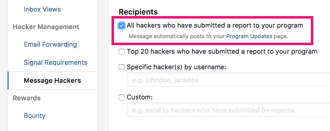

It's important to have good communication with hackers as it enables them to know what's going on with your program. In order to communicate any changes or announcements with your hackers, you can use the Message Hackers feature. 

To use the Message Hackers feature:
1. Go to your program's **Settings > Hacker Management > Message Hackers**. 
2. Select the recipients of your message. You can select from these options: 

Option | Details
------ | -------
All hackers who have submitted a report to your program | The message automatically posts to the **Updates** section of your security page. 
Top 20 hackers who have submitted a report to your program | The message is only sent to the top 20 hackers of your program. 
Specific hacker(s) by username | You can message only certain hackers by entering their usernames. 
Custom | Set your own custom group to message. E.g. hackers that have submitted 5+ reports

