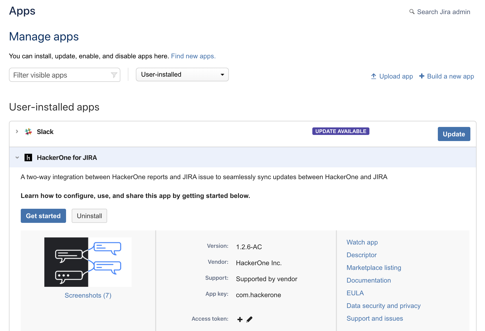
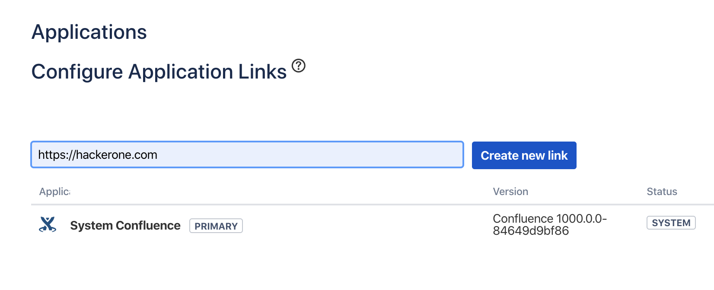
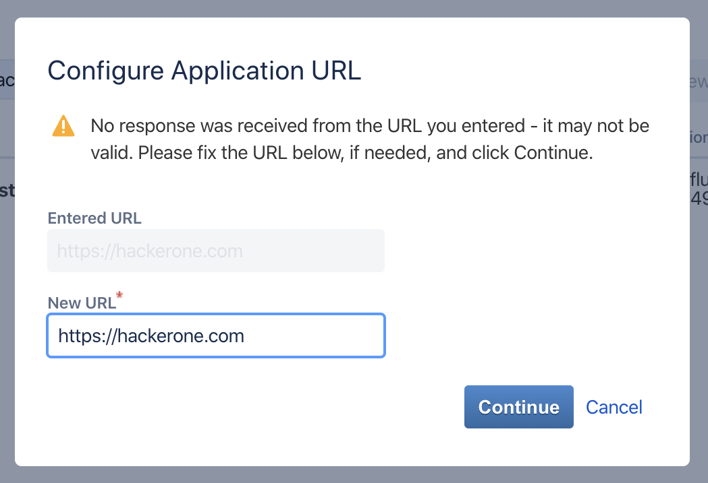
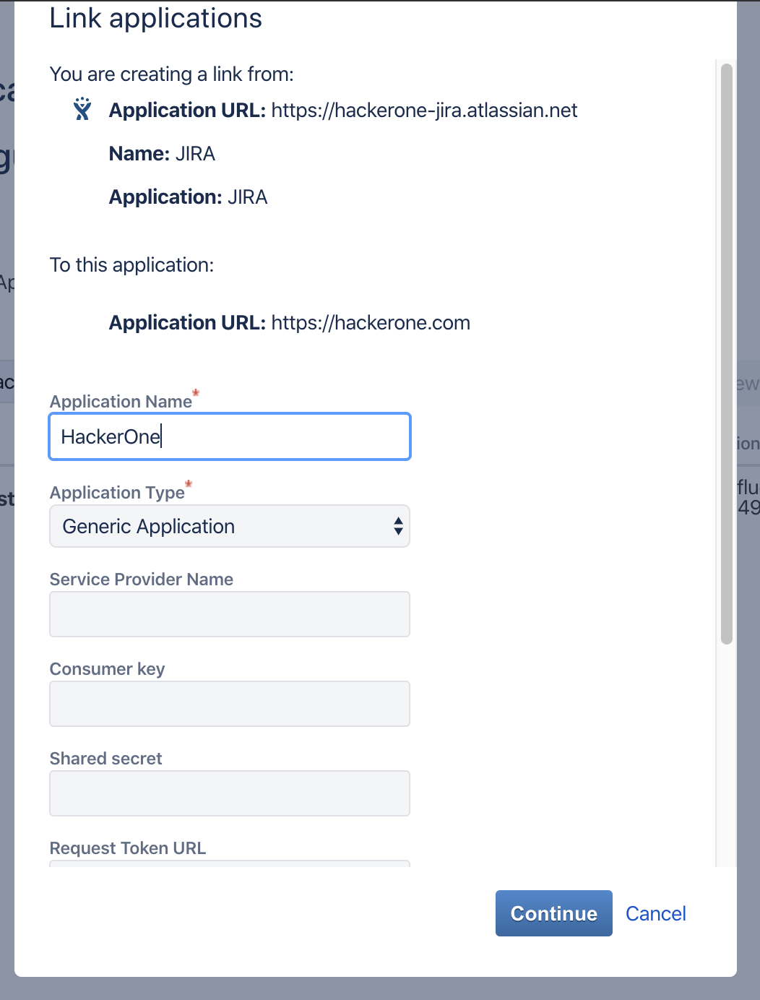
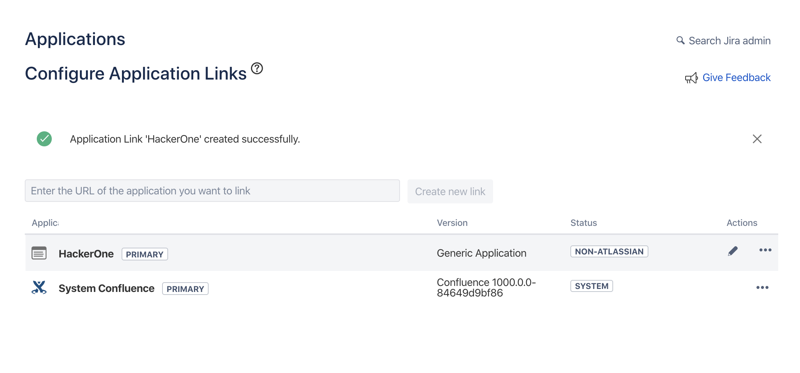
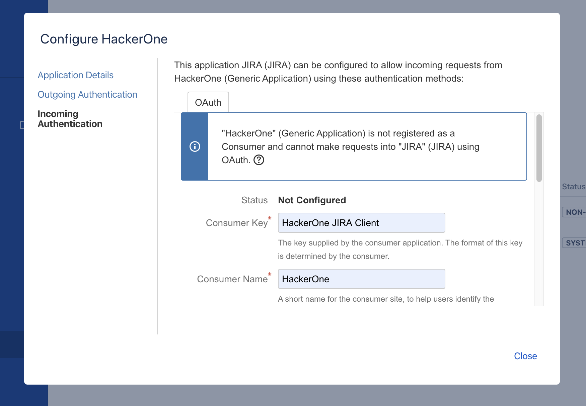

 If you have multiple HackerOne programs, you can integrate them to the same Jira instance whether you’re using the Jira Server or Jira Cloud integration.

To integrate multiple HackerOne programs to the same Jira instance:

1. Remove the “HackerOne for Jira” plugin only if you’re currently using Jira Cloud.
   <br>a) Go to [Jira](https://www.atlassian.com/software/jira).
   <br>b) Navigate to **Jira settings > Apps > Manage Apps**.
   <br>c) Click on the **HackerOne for Jira** app.
   <br>d) Click **Uninstall**.



2. Navigate back to HackerOne.
3. Go to **Settings > Program > Integration**.
4. Click the **Connect with Jira** link.
5. Choose **Jira Server** and you’ll be redirected to this 4-step setup screen where you can configure your Jira integration.


6. Navigate to the Configure Application Links console of Jira by going to **Jira Settings > Products > Application links**.



7. Enter `https://hackerone.com` to the field.
8. Click **Create new link**.
9. Ignore the warning message.



10. Click **Continue**.
11. Enter `HackerOne` for the **Application Name**.



12. Enter `Generic Application` for the **Application Type**.
13. Click **Continue**.
14. Click on the pencil icon on the **Configure Application Links** page to edit the HackerOne application.



15. Select **Incoming Authentication** on the left sidebar.



16. Enter the following information on the **Incoming Authentication** section of the Configure HackerOne window:

Field | Details
----- | --------
Consumer Key | HackerOne JIRA Client
Consumer Name | HackerOne
Public Key | Copy and paste from the key below

**HackerOne Jira public key**
```
-----BEGIN PUBLIC KEY-----
MIICIjANBgkqhkiG9w0BAQEFAAOCAg8AMIICCgKCAgEAy8H4gLqU2Lkkce11/Scn
zac5uLs4Wa3xkg8pwTJb4AaUXxPp5c49MVXRlGhLMeQ2Wv1AfNvxJu4gcmvUyn6Q
A9hD156grA7qXD3G7aX4DJ4N5ialNaDQGZCWRqxAqwrT7KoXZohbiima5bAyUjgG
SwdGKTIHp7djBNfWa8Wv9uDbJZkNRkhzcuJ65dmsPk0gURosCzo3FhL9e0kjVt66
GbTMjP02L0BZYpFhwTbHTsrw/xpmW9RRDGZ9jYNXbCeki17bYdVSdGswvamvzv5Y
4EBK4hV4ocs+MumEWC5lYn1zdWjXaQcDTnrQLgF1BJ//hB7l6nPSrynYCiM4ceCU
vo1/2p6nOvNvbBjVlRMIYbsrrUgaBT1tvdHRqTkBDpxzDEQcNBuEgxhxu7oHNDvK
HnZsorPPvfixqhpB3jcO9NuYujPakAV/ishjrwwQtRIRXqLAFHYYQxbzfikhi0xs
RJGg/kzpkmz9F93cATONpMFSVrg6a4Vxmt0Yt8zND2WNi/8qHCWN2yju2DUWLLRm
6MdAkz48MMTCmYXRybB+6g8a9F4YBdl2TGnWsYfQ1R/y0utRKBC+P7cQwVTP8eus
liA2Ts+KvYyVgD6StR629HFyNCNglm9+NuudtYdUUfIHGlEq769wLwHX3bgddqBW
hgko43a2w0IWTvNkga5FBcMCAwEAAQ==
-----END PUBLIC KEY-----
```

19. Click **Save**.

20. Navigate back to HackerOne and enter the URL of the Jira instance you want to authenticate with in the **Instance base URL** field in the **Configure an Application Link** step.
   

21. Click the **Authenticate with Jira** button to finalize the setup between HackerOne and your Jira instance.

22. Configure which HackerOne projects you'd like to escalate to Jira in the **Configure HackerOne to Jira escalation** window.
     * Select the **Allow me to select a project every time when I escalate an issue** checkbox to have the ability to select from multiple projects when creating Jira issues.
     * Select the Jira Priority you want to map to the corresponding HackerOne severity. This enables the right priority to be set when escalating a HackerOne report to Jira.

   

23. *(Optional)* Select which Jira actions you'd like to post onto HackerOne in the **Select Jira to HackerOne events** window. You can choose from:

Option | Detail
------ | -------
Status changed | Post an internal comment when an issue changes status.
Resolution changed | Post an internal comment when an issues changes resolution.
Priority changed | Post an internal comment when an issue changes priority.
Assignee changed | Post an internal comment when an issue changes assignee.
Comment added | Post an internal comment when someone comments on an issue.
Closed issue status | Resolve the report when an issue is closed with the selected status.

   

24. *(Optional)* Select which actions in HackerOne you'd like to post to Jira in the **Select HackerOne to Jira events** window. You can choose from:

Option | Detail
------ | -------
Comments | When someone comments on a report, post an update on the associated Jira issue.
State Changes | When someone changes the state of a report, post an update on the associated Jira issue.
Rewards | When someone awards or suggests a bounty and/or bonus, post an update on the associated Jira issue.
Assignee Changes | When someone assigns a user/group to a report, post an update on the associated Jira issue.
Disclosure | When disclosure is requested or a report becomes public, post an update on the associated Jira issue.
Synchronize attachments | Synchronize attachments linked with reports and comments to the associated Jira issue.

   

25. Follow steps 20-24 for each subsequent program you need to add an integration for. *Note:You only need to follow steps 20-24 for your other programs because the application link has already been created when integrating with your first program, and only 1 application link is needed to set up a Jira integration.*
