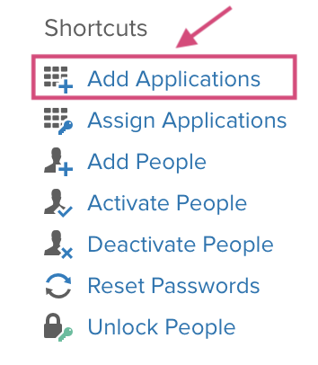
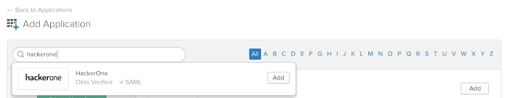
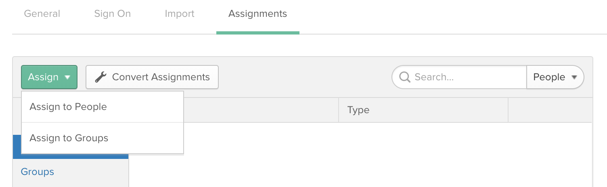

You can use your Okta credentials to sign in to HackerOne. To set up SSO via SAML for Okta:

1. Log in to Okta.
2. Click the <b>Admin</b> button.

3. Click <b>+Add Application</b> under Shortcuts.

4. Search for the HackerOne application and click <b>Add</b>.

5. Select the options you'd like in your General Settings.

6. Click <b>Next</b>.
7. Click <b>View Setup Instructions</b> on the Sing-On Options tab to open the "How to Configure SAML 2.0 for HackerOne" page. Keep this page open for setting up SAML for HackerOne in the later steps.

8. Update the Credentials Details section and click <b>Done</b>.

9. Assign the HackerOne application to the people or groups that should have access to the application on the Assignments tab.

10. [Open HackerOne](https://www.hackerone.com/) in a new tab.
11. Follow the SAML setup instructions [here](/programs/single-sign-on-sso-via-saml.html). <ul><li>Copy the Single-Sign On URL and the X.509 Certificate from the “How to Configure SAML 2.0 for HackerOne” page that you accessed in step 7 and paste them in the corresponding fields during setup.</li></ul> 
