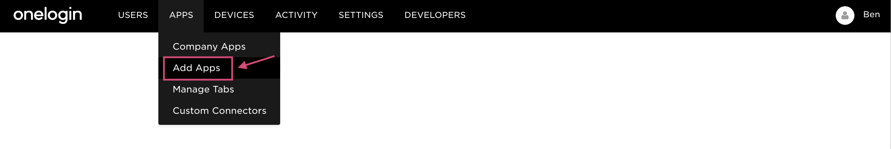
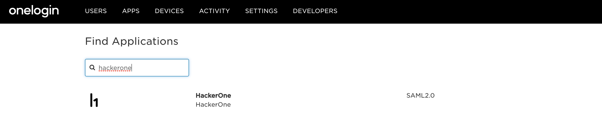
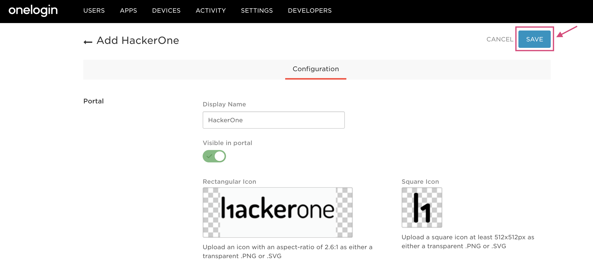
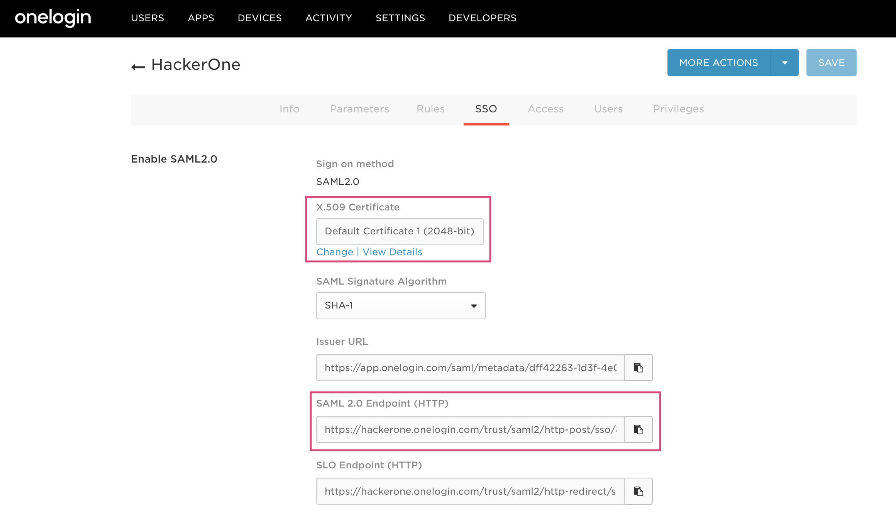
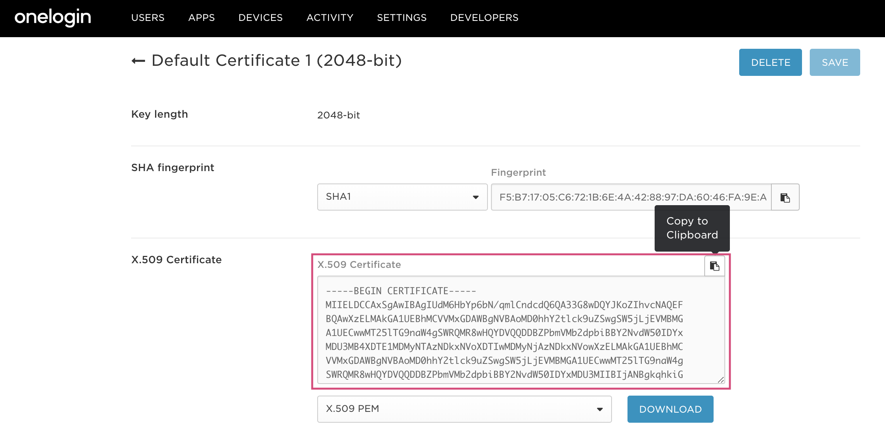

You can use your OneLogin credentials to sign in to HackerOne. To set up SSO via SAML for OneLogin:

1. Log in to OneLogin.
2. Click on Administration.

3. Go to <b>Apps > Add Apps</b>.

4. Search for the HackerOne application and select it.

5. Click Save on the Configuration page.

6. Copy the X.509 Certificate and the SAML 2.0 Endpoint (HTTP) on the SSO tab. <i>Click View Details to get the full X.509 Certificate.</i>

7. [Open HackerOne](https://www.hackerone.com/) in a new tab.
8. Follow the SAML setup instructions [here](/programs/single-sign-on-sso-via-saml.html). <ul><li>Paste the Single-Sign On URL and the X.509 Certificate that you copied from step 6 into the corresponding fields during SAML setup.</li></ul> 
