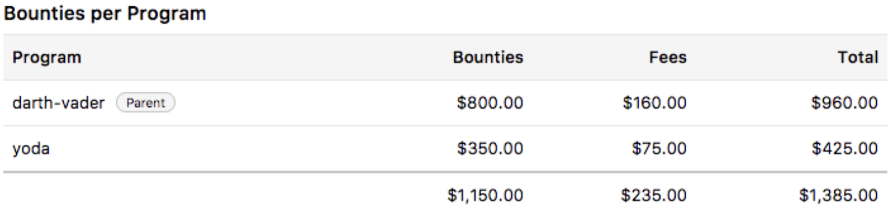

There are various programs on HackerOne that are associated with a larger organization. Such programs are referred to as parent/child programs, where the parent program is the primary account, and any subsequent child is a subordinate program that is linked to the parent. For instance, an organization (the parent) could be comprised of multiple different companies (the children), each with their own HackerOne program that has their own budget and management. Or, they can also be organizations that have set up multiple programs for each of their products.

Child programs still function as their own program in which they still need to:
* Set their own program settings
* Invite their own hackers
* Manage their own reports

However, parent/child programs are still able to function and work together by:
* Sharing a bounty pool
* Transferring reports between programs

### Sharing a Bounty Pool
Parent/child programs have the option to share a bounty pool so that the main organization doesn’t need to allocate specific dollar amounts for each program, but rather, they can pull their funds from a master pool. This will prevent programs from being blocked in having to contact HackerOne to manually transfer funds between programs. Programs can opt-in to this feature if they’re using the prepayment method to pay bounties.

When you opt-in to this feature, the parent program is able to keep track of the total amount of funds used from each child program so that they don’t need to access each account separately.

### Transferring Reports between Parent/Child Programs
Parent programs can transfer reports to child programs and vice versa. As the report is transferred from one program to another, it appears in the transferred program’s inbox with an activity log about the transfer.  

To transfer reports between programs:
1. Go to your inbox and select the report you want to transfer.
2. Expand the action picker at the bottom of the report above the comment box.
3. Select <b>Transfer report</b>.
4. Select the name of the program you want to transfer the report to. <i>A list of programs will populate that you can choose from.</i>
5. Click <b>Transfer report</b>.

The report will be transferred to the selected program.

#### FAQs:
If the report is transferred from a public to a private program:

Question | Answer
-------- | -------
Is the hacker automatically invited to the private program? | No. The program must manually invite the hacker to their program if they want the hacker to actively participate in it. The hacker will still be able to comment on the original report they submitted, but won’t be able to submit any new reports to the child program, unless they’re explicitly invited to it.
Can the hacker see the security page of the private program? | No. The hacker must be a participant of the program in order to see the security page.
Can the hacker see that the report was transferred? | Yes. The transfer will be listed in the activity log of the report.
