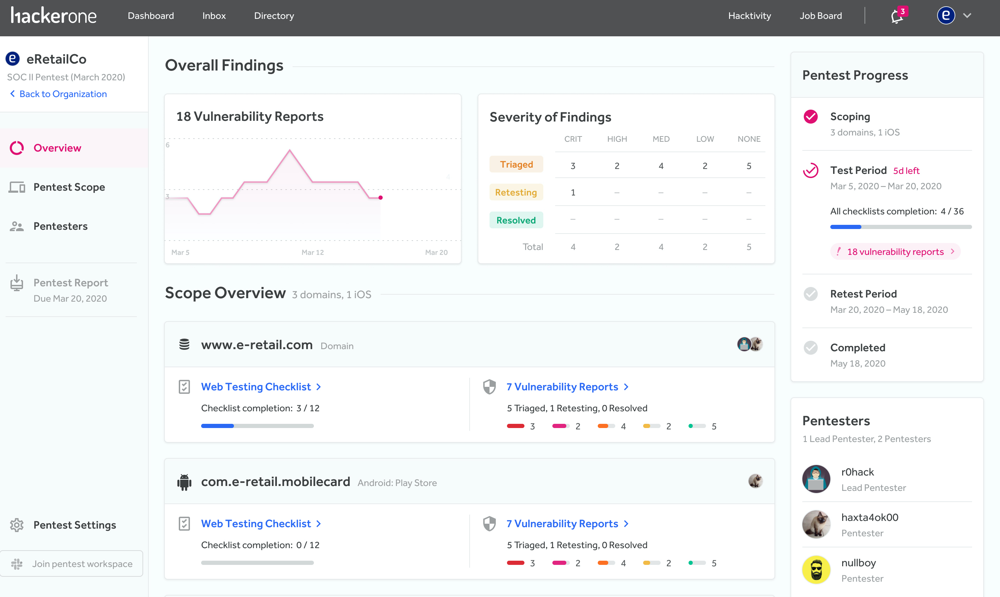

In a penetration test (pentest), authorized hackers simulate a cyberattack on a specific application to test how secure the application is. HackerOne pentests are performed by select hackers from the HackerOne community with skills and experience that best match your applications in scope.

> **Note:** To take part in HackerOne pentests, contact your account manager.  

### How it works

Here are the steps outlining the process of pentests:
1. You'll work with one of HackerOne's technical program managers to scope out and set up your pentest.
2. HackerOne will look at all pentest applicants and form the best pentest team for your pentest.
3. When your pentest begins, the pentest team will have 2 weeks to find vulnerabilities.
4. After testing has been completed, the lead pentester will draft and provide a summary report of the team's findings.
5. You'll be able to remediate the found vulnerabilities.
6. Once the vulnerabilities have been remediated, the pentest team will retest the vulnerabilities to make sure they’re fixed.

To learn how pentests work from the hacker side, see the [Pentest Overview page for pentesters](/hackers/pentest-overview.html).

### Managing Pentests
After you log in to HackerOne, you’ll be met with the *Pentest Overview* page where you can view all information related to your pentest.

The Overview page enables you to view the:
* Number of vulnerability reports by severity and status.
* Members that comprise your pentest team. Your team includes the pentesters as well as your HackerOne customer success manager. As most communication between you and the team happens through Slack, there’s a link that’ll lead you to join the Slack workspace for your pentest.
* Assets that make up your pentest scope.  Each asset is linked to its own testing checklist. You can also see the number of vulnerability reports associated with each asset as well as the state and severity.
* Progression status of your pentest. There are 4 progress phases to your pentest. They are:

Pentest Phase | Details
------------- | --------
Scoping | Assets are added to the scope of your pentest and you can set the dates of your testing period.
Test Period | Pentesters actively work on your pentest.
Retest Period | The pentest team retests any vulnerabilities that have been remediated from the pentest.
Completed | Your pentest is finished and the report is available to download.

When the final copy of your pentest report is ready, you can also directly download your report.

On the left-hand side of the page, you can access these pages to go deeper into your pentest:

Page | Details
---- | -------
Pentest Scope | You can view the details behind the progress of your checklists associated with your assets and see what each checklist entails.
Vulnerabilities | You can view all the vulnerabilities that have been found and the associated vulnerability report, as well as the status and severity of the report.   If you have an integration set up to a tracking tool like Jira, you can choose to link your reports to the tool to get visibility into the remediation status.
Pentest Team | You can view the members part of your pentest team.

### Edit/View Pentests
After pentesting has been enabled for your program, your new pentest will be listed on the **Pentests** tab of your security page.

To edit or view your pentests:
1. Go to your program security page.
2. Click on the **Pentests** tab.
3. Select the pentest you want to view. The pentests can be in these different states:

State | Details
----- | -------
Draft | The pentest is not live and is still being written up.
Scheduled | The team is selected and the pentest is scheduled to start.
Running | Pentesters are actively working on the pentest.
Report due | The testing window has finished but the report is not completed yet.
Completed | A summary report has been submitted and the pentest is finished.
Archived | A past pentest that’s no longer active.

### Pentest Ratings
At the end of the pentest, you'll have 30 days to rate and provide feedback about your experience with HackerOne pentests. You'll also be able to rate each of the pentesters you worked with and provide constructive feedback to help them improve in their skills. The pentesters will also have the ability to provide feedback regarding your pentest program. The pentesters you rate will only be able to see the feedback that pertains specifically to them. 
