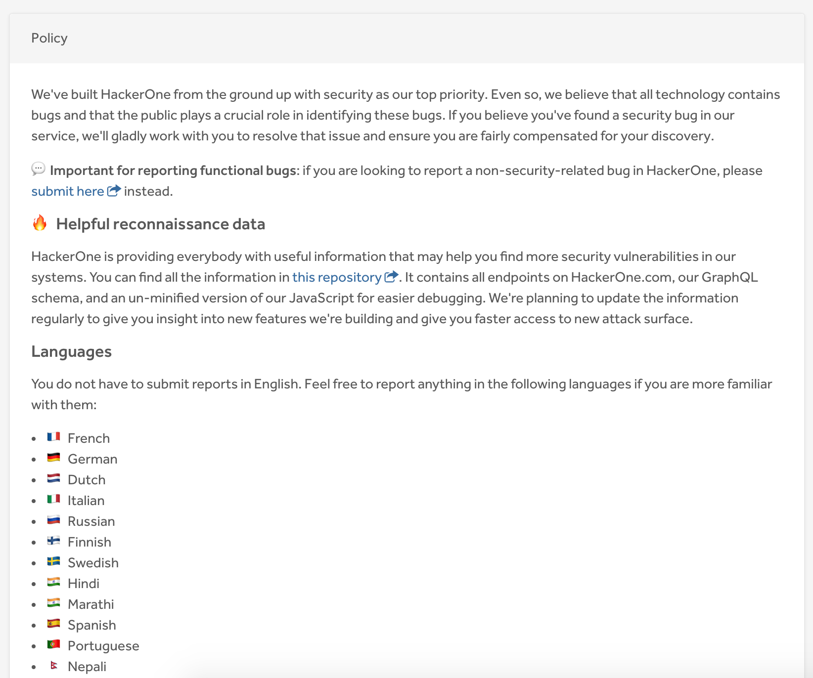

The [policy](good-policies.html) section enables organizations to publish information about their program in order to communicate the specifics about their program to hackers. Organizations typically publish a vulnerability disclosure policy with guidance on how they want to receive information related to potential vulnerabilities in their products or online services.

The policy also includes your program’s [scope](defining-scope.html) which is the list of items you'd like hackers to test and send reports in for. It is often defined by the domain name for web applications, or by the specific App Store / Play store mobile apps that your company builds.

