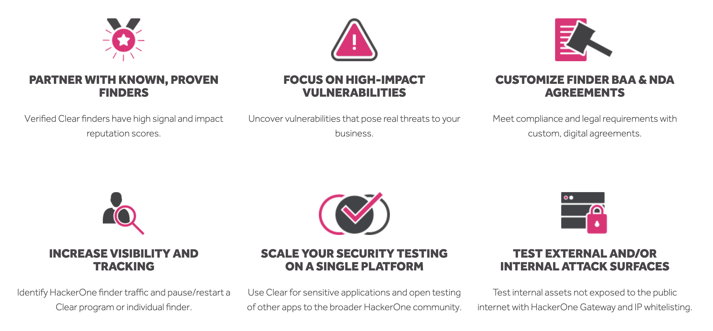
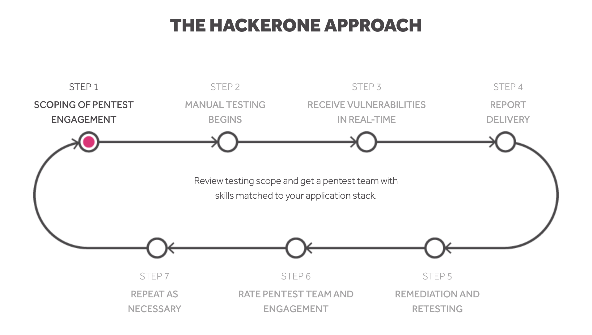

HackerOne is the #1 hacker-powered security platform that helps organizations find and fix critical vulnerabilities before they're criminally exploited.

HackerOne offers 5 different products that you can choose from:
* HackerOne Response
* HackerOne Challenge
* HackerOne Bounty
* HackerOne Clear
* HackerOne Pentests

### HackerOne Response
Establish an ISO 29147 compliant disclosure policy to safely receive and act on vulnerabilities discovered by external third-parties. This welcomes a "See Something, Say Something" process that helps ensure that security reports end up with your security team instead of unreliable channels like social media.  

### HackerOne Challenge
A private, project-based, and time-bound vulnerability assessment program. Challenges are perfect for organizations looking to supplement or replace traditional penetration tests with ethical hackers looking for severe vulnerabilities. Every Challenge  includes a detailed report to help meet compliance requirements. [Learn more](https://www.hackerone.com/sites/default/files/2017-12/Traditional%20Pentesting%20versus%20Hacker-Powerd%20Pentesting.pdf) about hacker-powered pen testing versus traditional pen testing.

### HackerOne Bounty
A program where trusted hackers are incentivized to continuously test for critical vulnerabilities. Bounty programs can be private and invite-only or fully public, and all incentives will reflect the organization’s priorities.

You can choose between 2 types of programs:
* A managed program enables HackerOne to design, manage, and support your program from end to end.
* A hosted program enables you to run and manage your own program.

### HackerOne Clear
A program that requires proven hackers to be background-checked in order to participate in them. Only hackers that are background-checked are able to participate in such programs due to the sensitive nature of their systems.

### HackerOne Pentests
Authorized hackers simulate a cyberattack on a specific application to test how secure the application is. HackerOne pentests are performed by select hackers from the HackerOne community with skills and experience that best match your applications in scope.

### Next Steps
If you've decided to:
* Start a HackerOne Bounty or Response program, see: [Program Starting Point](program-starting-point.html).
* Start a HackerOne Challenge program, send a note to challenge@hackerone.com.
