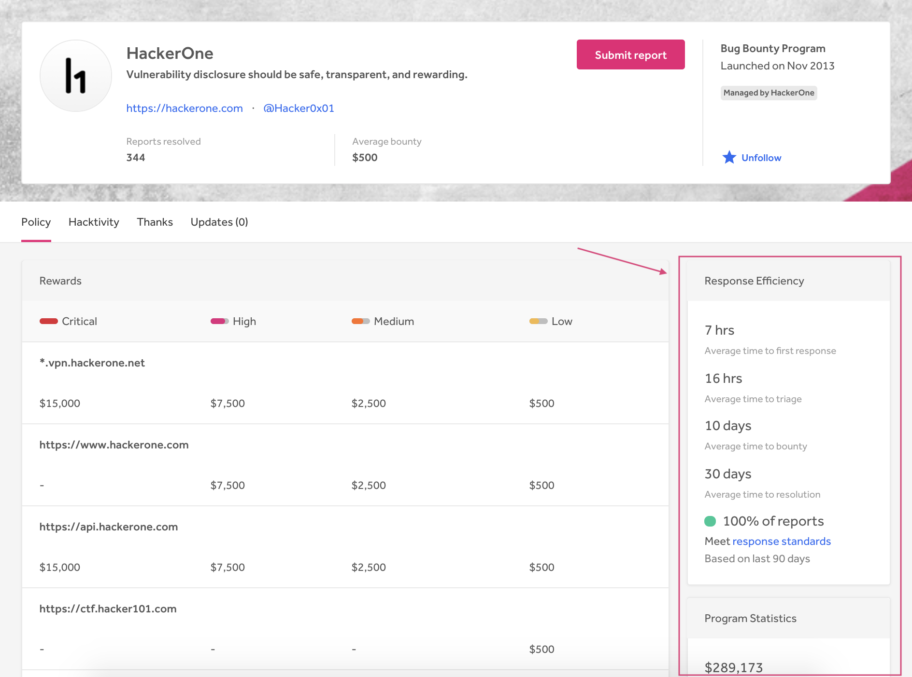
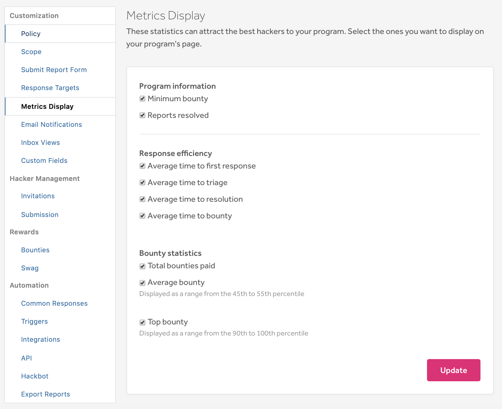

Program metrics show how healthy a program is. They enable hackers to see various statistics regarding:
* Program information
* [Response efficiency](#response)
* [Program statistics](#program)

The metrics are displayed on the right side of the program's security page.

### Displaying Program Metrics
To display program metrics on your security page:
1. Go to **Program Settings > Program > Customization > Metrics Display**.
2. Select the statistics you want to display on your security page.
3. Click **Update**.

### Response Efficiency Metrics

Response efficiency metrics include:
* Average time to first response
* Average time to triage
* Average time to resolution
* Average time to bounty

The averages are calculated by the last 90 days. These metrics give hackers a better idea of how responsive a program is. Learn more about [response efficiency metrics](response-target-metrics.html).

### Program Statistics

Program statistics are calculated over a program’s lifetime. They set realistic expectations with hackers and security teams for how active your program is. Within the program statistics section of your security page, hackers can view:

Item | Details
---- | -------
Total bounties paid | Total bounties paid can be a strong indicator that a bounty program is active and healthy.
Average bounty | The average bounty serves as rough guidance for how much a hacker can expect in return for a valid report. It's displayed as a range from the 45th to 55th percentile. 
Top bounty range | Displayed as a range from the 90th to 100th percentile.
Reports resolved | The total number of valid reports that have been resolved.
Hackers thanked | The total number of hackers that have submitted valid reports.

><i>Note: Any reports filed by a security team's members will not be reflected in the metrics.</i>
