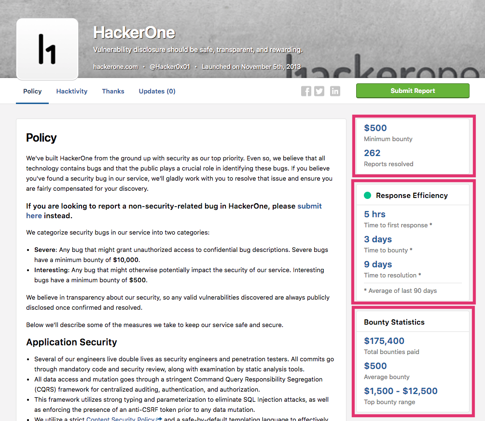
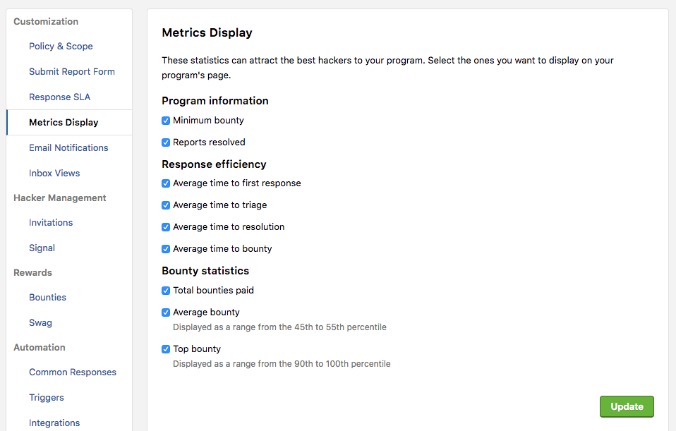

Program metrics show how healthy a program is. They enable hackers to see various statistics regarding:
* Program information
* Response efficiency
* Bounty statistics

The metrics are displayed on the right side of the program's security page. 

### Displaying Program Metrics
To display program metrics on your security page:
1. Go to your program's **Settings > Programs > Customization > Metrics Display**. 
2. Select the statistics you want to display on your security page. 
3. Click **Update**. 

### Response Efficiency Metrics
Response efficiency metrics include: 
* Average time to first response
* Average time to triage
* Average time to resolution
* Average time to bounty
The averages are calculated by the last 90 days. These metrics give hackers a better idea of how responsive a program is. 

### Bounty Statistics

Bounty metrics are calculated over a program’s lifetime and set realistic expectations with hackers and security teams. You can view:
* Total bounties paid
* Average bounty (Displayed as a range from the 45th to 55th percentile)
* Top bounty (Displayed as a range from the 90th to 100th percentile)

Total bounties paid can be a strong indicator that a bounty program is active and healthy. The mean and median bounty also serve as rough guidance for how much a hacker can expect in return for a valid report. 

*Note: Any reports filed by a security team's members will not be reflected in the metrics.*
