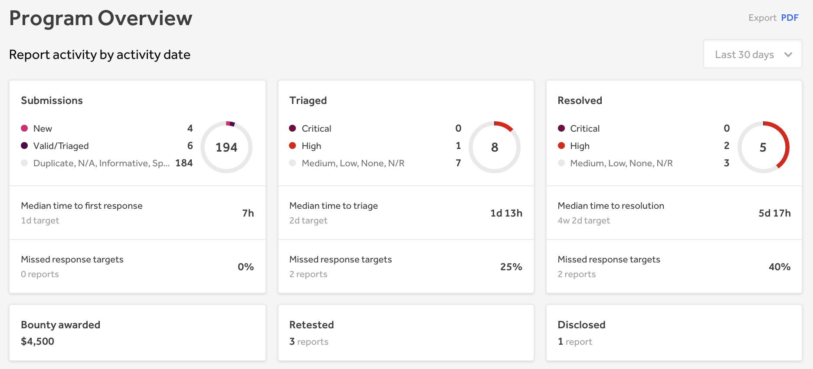
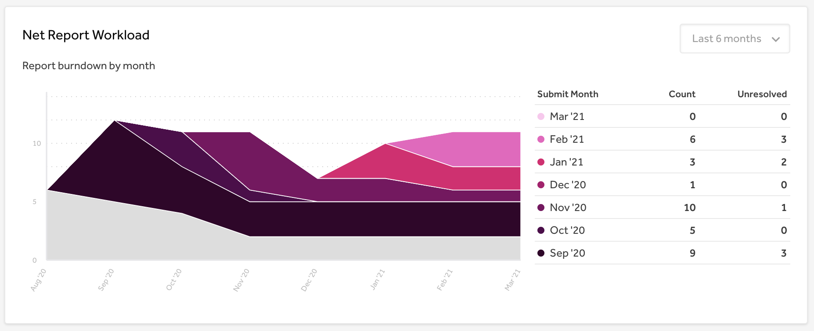
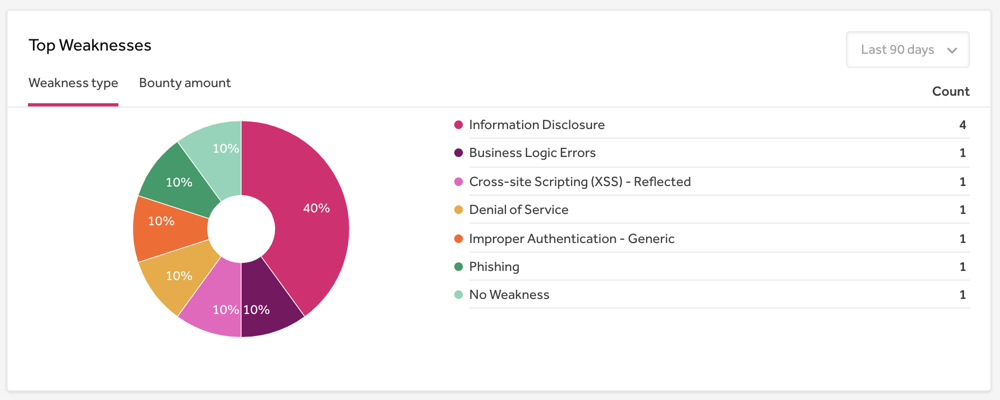
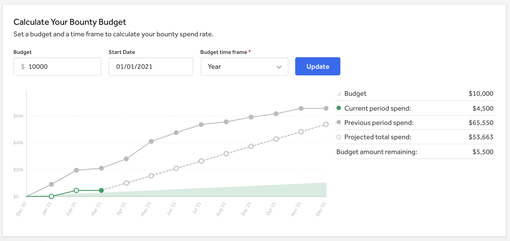

The Overview page of the Program Dashboard provides an overarching view of important data and statuses regarding your program. The page is broken up into various sections to help you better understand and get a comprehensive look at valuable details of your program.

> This feature is currently in beta and is only accessible to select programs. If you'd like to participate in the beta, please reach out to your program manager.

### Report Activity

The report activity section shows data on reports that were acted upon within the selected date range.

You'l be able to view these statistics on report activity:

Field | Details
----- | --------
Submissions | Shows the number of reports that were submitted in the selected time frame by [report state](report-states.html).  The median [time to first response](response-target-metrics.html) and the percentage of reports that missed the [response target](response-targets.html) corresponds to the number of submissions in the selected time frame.
Triaged | Shows the number of reports that were triaged in the selected time frame by [severity](severity.html).  The median [time to triage](response-target-metrics.html) and the percentage of reports that missed the [response target](response-targets.html) corresponds to the number of reports that were triaged in the selected time frame.
Resolved | Shows the number of reports that were marked as resolved in the selected time frame by [severity](severity.html).   The median [time to resolution](response-target-metrics.html) and the percentage of reports that missed the [response target](response-targets.html) corresponds to the number of reports that were resolved in the selected time frame.
Bounty Awarded | Shows how much bounty has been awarded in the selected time frame.
Retested | *(Only for programs with [retesting](retesting.html))* Shows the number of reports that have been retested in the selected time frame.
Disclosed | Shows the number of reports that have been [disclosed](disclosure.html) in the selected time frame.

### Net Report Workload

The net report workload shows the cadence of how many reports were submitted and resolved over time. The graph specifically shows how many reports were submitted each month as well as how many reports are left unresolved from the month that they were submitted, which is known as the report burndown. In each month you can see the total number of reports that need to be worked on, giving you the net report workload.

### Top Weaknesses

The Top Weaknesses section lists the most common weakness types that have been submitted to your program in the selected time frame.

### Bounty Budget Calculator

The bounty budget calculator enables you to see if your program will be over or under budget by the fiscal year so that you can better plan how much you should budget for your bounties. You can input your budget as well as your start date and budget time frame by quarter or year, and an average will be calculated to predict your program’s future spending trend. The average is calculated based on your program’s previous bounty spending trends.

### Actionable Reports

Actionable reports are [open reports](report-states.html) in your program that you can respond to and take action on. You can click on the report title, and it will take you to the corresponding report in the inbox so that you can respond right away.

You’ll be able to see these different categories of reports within the actionable reports section:

Category | Details
-------- | --------
Missed response targets | Displays the list of [open reports](report-states.html) in your program that have missed the response target so that you can respond to them quickly.
Approaching response targets | Displays the list of [open reports](report-states.html) in your program that have approaching response targets so that you can respond to them in time.
Additional Actionable Reports | Displays the list of [open reports](report-states.html) in your program that haven’t missed a response target nor have any approaching response targets. This enables you to keep track of reports in your inbox that you can be mindful of responding to.
