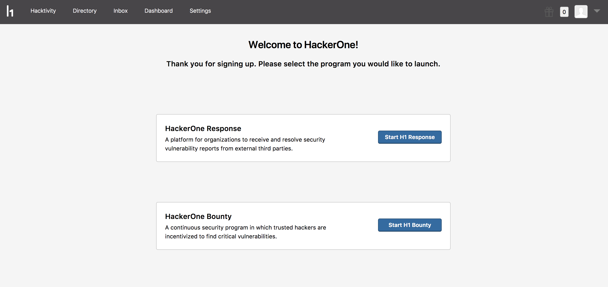

Congratulations on deciding to set up your hacker-powered security program on HackerOne! Here are the steps that'll get you up and running:

1. Go to hackerone.com.
2. Click **Sign Up**.
3. Fill out all fields on the form.
4. Click **Create Program**.
5. A confirmation email will be sent asking you to confirm your email address. Go to your email and click **Confirm email address**.
6. You'll be taken to a page where you can select the type of program you'd like to launch. You can choose from:

Option | Detail
------ | ------
[HackerOne Response]("/programs/start-h1-response") | A private vulnerability disclosure program for organizations to receive and resolve security vulnerability reports from external third parties.
[HackerOne Bounty]("/programs/start-h1-bounty") | A continuous security program in which trusted hackers are incentivized to find critical vulnerabilities.

### Next Steps
* [Start H1 Response]("/programs/start-h1-response") or [Start H1 Bounty]("/programs/start-h1-bounty").
* [Contact HackerOne](https://support.hackerone.com/hc/en-us/requests/new) to work with one of our program managers to get guidance on setting up your program.
