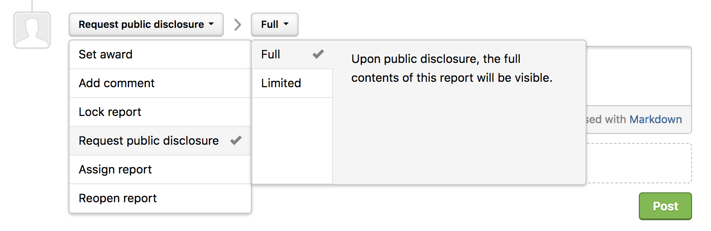
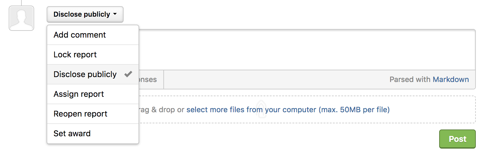
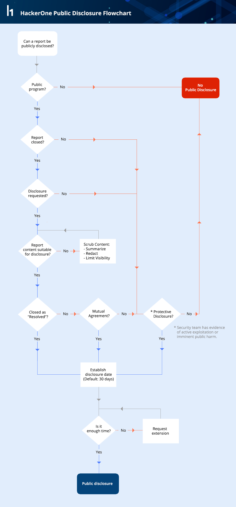

Public disclosure enables you to be transparent about the security vulnerabilities found for your program. HackerOne's public disclosure process balances transparency with control over what information is shared with the public.  

Programs can choose from 3 disclosure settings:

Option | Detail
------ | -------
Disclosure by Default | The hacker or your security team can request public disclosure for any closed report in your program. If the admin of your program agrees to disclosure, the contents of the report will be made public within 30 days.   *This is the default setting for all verified programs*.
Disclosure requiring Mutual Agreement | The hacker can request public disclosure for any closed report in your program. If your program security team agrees to disclosure, the contents of the report will be made public. If the security team doesn't take any action, the contents of the report will remain private.  *You must request to opt-in to this option.*
Disclosure Disabled | Public disclosure isn't allowed for any report.

### Requesting Public Disclosure
Both hackers and program members can request public disclosure. To request public disclosure:
1) Go to the report you want to publicly disclose.
2) Make sure the report is closed.
3) Select **Request public disclosure** in the action picker at the bottom of the report.
4) Select whether you want to disclose the **Full** report or **Limited**.

Option | Details
------ | -------
Full | Upon public disclosure, the full contents of the report are visible including the:<li>Vulnerability information</li><li>Summary</li><li>Timeline which includes comments and attachments</li> *Note: Internal comments are kept hidden.*  
Limited | Only the summary and timeline of the activity are visible. All comments and attachments are hidden. Limited disclosure allows for greater control over sensitive or extraneous information. 

5) *(Optional)* Enter a comment to describe your reasons for public disclosure.
6) Click **Post**.    

After public disclosure has been requested, the admin of the of the program can choose to publicly disclose the report. They can select **Disclose publicly** to disclose the report.

This diagram illustrates HackerOne's public disclosure process:

For more information, please read the full [HackerOne Disclosure Guidelines](https://hackerone.com/disclosure-guidelines).  There is a lengthier blog post on [Public Disclosure](https://www.hackerone.com/blog/public-disclosure-on-hackerone?utm_source=h1&utm_medium=help&utm_campaign=hdpdw) as well.  If disclosure was accidentally initiated or you have concerns about this process, please [submit a support request](https://support.hackerone.com/hc/en-us/requests/new).
