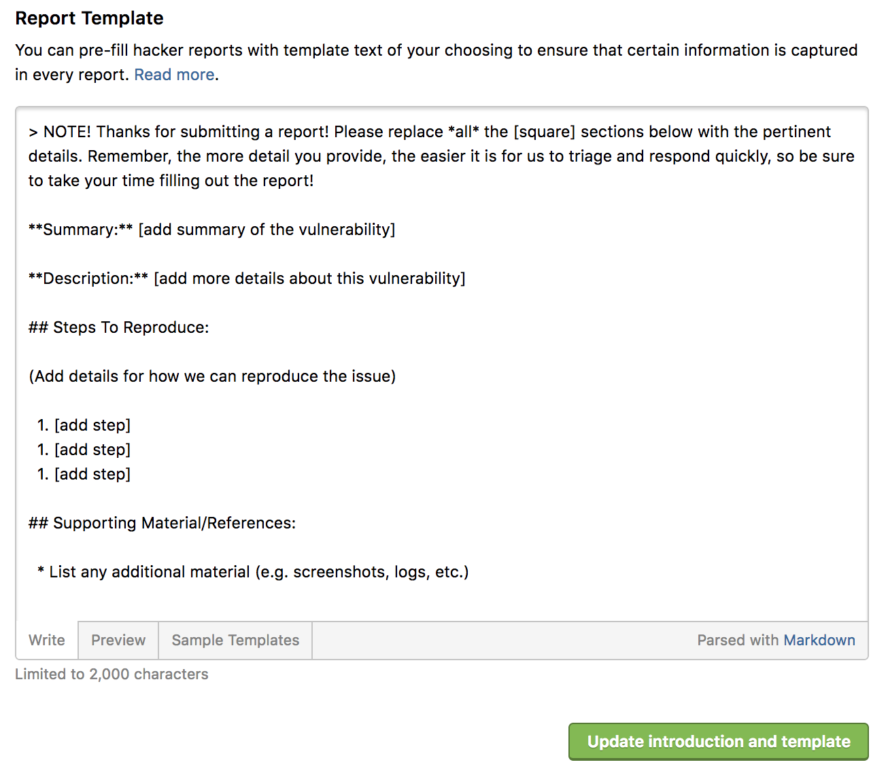
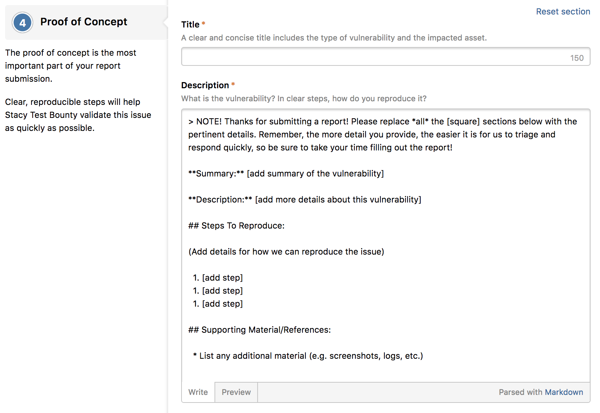

One of the most important elements of running a successful bug bounty program, is ensuring you get high quality reports. Report templates help to ensure that hackers provide you with all of the information you need to verify and validate the report.

Instead of the report submission form being an empty white box where the hacker has to remember to submit the right details, a report template can prompt them with the details you need.

With report templates, you create a Markdown powered template, and when a hacker submits a new report, the template is pre-loaded, which can then request certain types of information.

### Adding or Editing a Report Template
To add or edit a report template:
1. Go to your **Program Settings > Program > Customization > Submit Report Form**.
2. *(Optional)* Choose a sample template in the **Sample Templates** tab of the **Report Templates** section.

   

3. Write up a new template or edit a sample template in the **Write** tab.

   

3. Click the **Update introduction and template** button.

### Result
Hackers submitting reports to your program will then be greeted with a pre-populated Issue information box, assuming no report draft has previously been saved.

