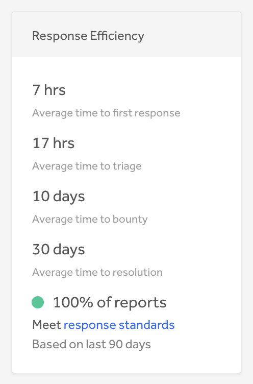

HackerOne utilizes average metrics and colored indicators to show how your program is doing in meeting healthy success criteria.

### Average Response Efficiency Metrics

HackerOne displays a program's average response efficiency metrics on the security page to enable hackers to see how responsive your program is in:
* giving a first response
* paying out a bounty
* resolving a vulnerability

The average times are calculated on a rolling 3 month basis, and you can configure which metrics to display in **Program Settings > Program > Metrics Display**.

### Colored Indicators

A program’s performance against HackerOne's response standards (Time to First Response = 5 business days; Time to Triage = 10 business days) is displayed on its security page and report submission page. This provides additional context to potential hackers when they're looking to submit reports to your program.

#### Indicator Details
How are the percentages calculated? 
* The percentage is determined by this calculation: **((1-(# of reports that didn't meet response standards / # of total reports created))* 100)**
* The percentage of reports that meet response standards is based on reports created within the last 90 days. 
* If a report violated response standards at some point during the last 90 days but is no longer violating the standards, it'll still count towards the # of reports that didn't meet response standards.
* A single report can violate both the response standards for Time to First Response and Time to Triage but each report can only count once as a report that didn't meet the response standards. 

A colored indicator accompanies the percentage of reports that meet response standards. Below are the indicator types and criteria:

Indicator Type | Criteria
-------------- | ----------
Green | ≥ 75% of reports meet response standards
Yellow | < 75% and ≥ 25% of reports meet response standards
Red | < 25% of reports meet response standards
