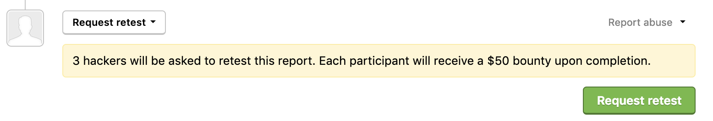
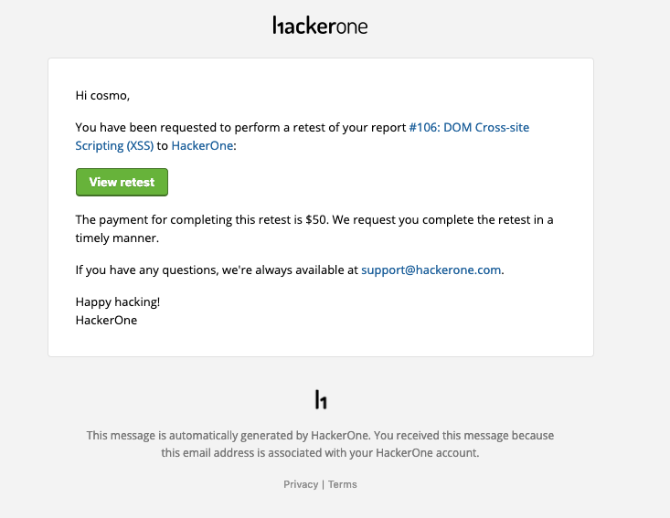
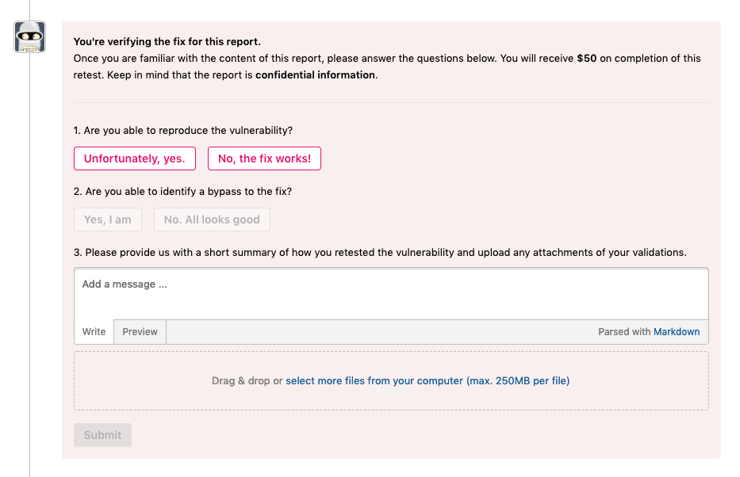
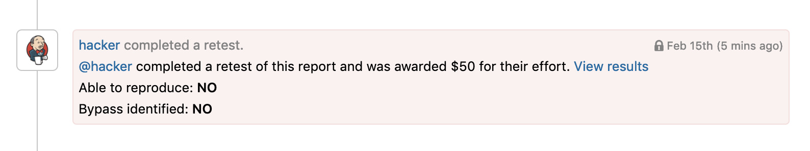
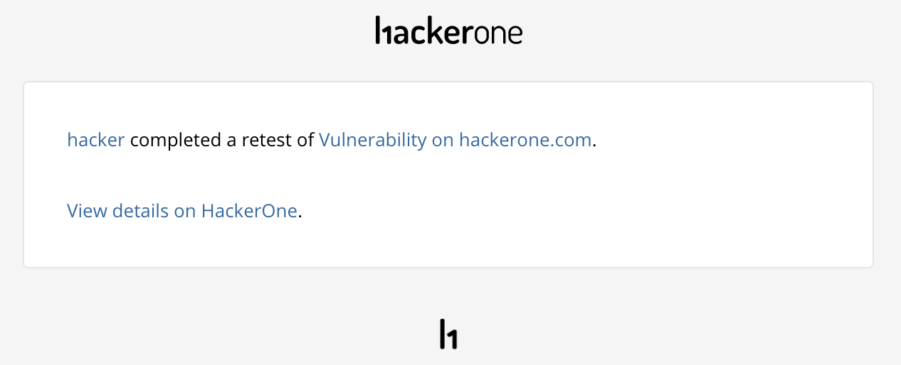
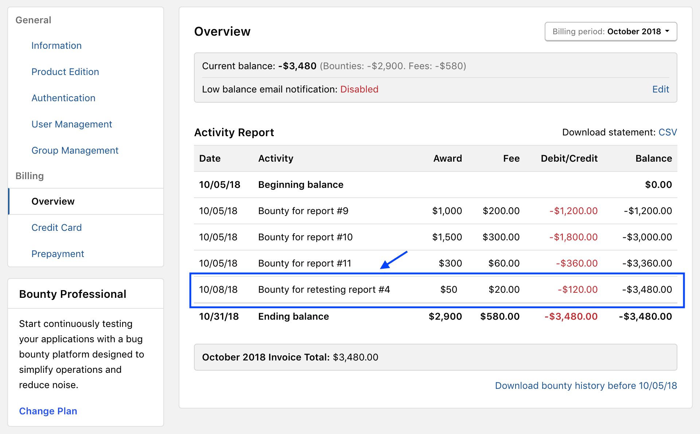
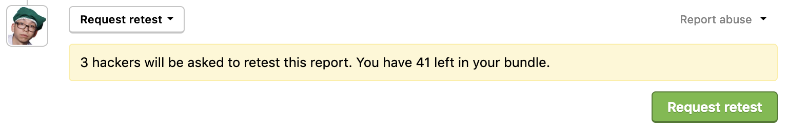

As programs receive vulnerability reports and work on deploying fixes, they need proof that their vulnerabilities have actually been fixed. Asking hackers to verify whether a vulnerability has been fixed is a good way to secure the protection of your asset’s data. You can elect to invite hackers to retest your vulnerabilities to verify fixes. Each hacker that participates in the retest will receive a $50 bounty upon completion.

> Retesting is available as an add-on. To learn more about adding Retesting to your program, contact your account manager.

### How It Works
To have hackers retest a vulnerability:
1. Choose the <b><i>Resolved</i></b> report in your inbox that you want to assign hackers to retest. **Note:** Your report must be [closed and marked as Resolved](report-actions.html#close-a-report) in order to retest.

2. Change the action picker to <b>Request retest</b>.
3. Click <b>Request retest</b>.

2 hackers participating in your program will be invited to retest the report through email.

In addition, the hacker that originally submitted the report will also be invited to participate in the retest, so that there will be a total of 3 retesters for your report.

When the hacker clicks <b>View retest invitation</b> in the email, they’ll be able to <b>Accept</b> or <b>Reject</b> the invitation.

 Upon acceptance, participating hackers will be able to familiarize themselves with the vulnerability report and check to see that the vulnerability is properly fixed. After they’ve tested the vulnerability, they can click the <b>answer these questions</b> link in the report banner to submit their findings.

The hacker will be asked to answer the following questions:
* Are you able to reproduce the vulnerability?
* Are you able to identify a bypass to the fix?

If they were able to identify a bypass, they can can submit a new vulnerability report and enter the report ID in the questionnaire.

Hackers are also asked to provide a short summary of how they retested the vulnerability, and are also able to upload any attachments of their validations.

Upon submission of the questionnaire, you’ll be notified that a hacker has completed a retest of your report within the report timeline and also through email.

Click on <b>View results</b> to see the status and findings of the retest efforts. If the hacker was able to find a bypass to the vulnerability, you can view the new vulnerability report.

Hackers that completed the retest will automatically be awarded $50. The payment is a regular bounty payment and the transaction for retesting will show in your billing overview statement.

><i>There’s currently no effect to reputation for verifying vulnerability fixes and there’s also no time limit for hackers to complete the retest.</i>

### Payments
You can opt-in to pay for retesting through Retest Bundles. With Retest Bundles, you can purchase a bundle of retests that can be used with your HackerOne subscription. When you use all of your retests, you can choose to purchase more. Contact your program manager to learn more about bundle options.   
