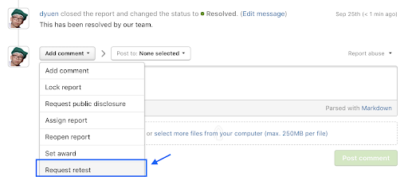
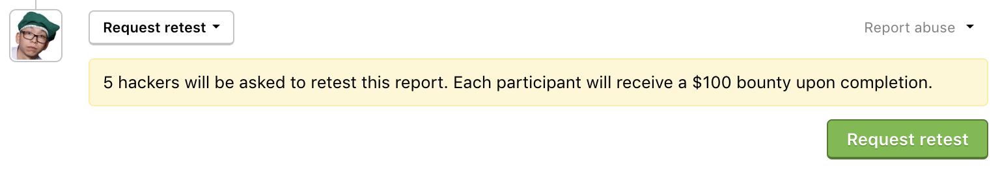
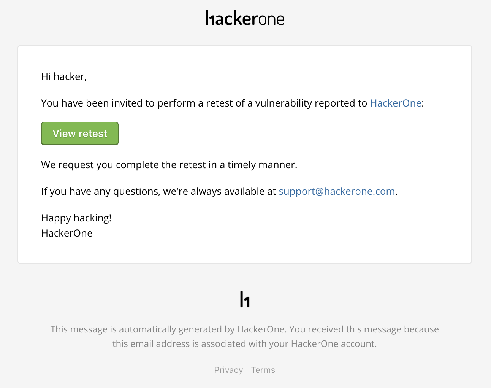
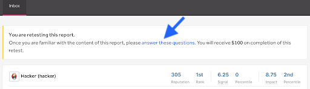
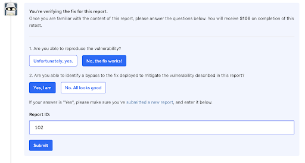
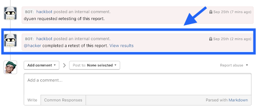
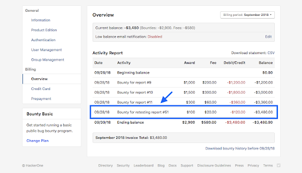

As programs receive vulnerability reports and work on deploying fixes, they need proof that their vulnerabilities have actually been fixed. Asking hackers to verify whether a vulnerability has been fixed is a good way to secure the protection of your asset’s data. You can elect to invite hackers to retest your vulnerabilities to verify fixes. Each hacker that participates in the retest will receive a $100 bounty upon completion.

<i>Inviting hackers to retest your vulnerabilities is a new feature that is currently in the beta phase. To be a part of the beta testing, please reach out to your program manager.</i>

### Set Up
There’s currently no set up on your end that’s needed to enable the feature. Your program manager will enable the feature for you.

### How It Works
Once your program manager has enabled the feature, to have hackers retest a vulnerability:
1. Choose a resolved report in your inbox that you want to assign hackers to retest.
2. Change the action picker to <b>Request retest</b>.

3. Click <b>Request retest</b>.

The original reporter as well as 4 random hackers participating in your program will be invited to retest the report through email.

When the hacker clicks <b>View retest</b> in the email, they’ll be able to familiarize themselves with the vulnerability report and check to see that the vulnerability is properly fixed. After they’ve tested the vulnerability, they can click the <b>answer these questions</b> link in the report banner to submit their findings.

The hacker will be asked to answer the following questions:
* Are you able to reproduce the vulnerability?
* Are you able to identify a bypass to the fix?

If they were able to identify a bypass, they can can submit a new vulnerability report and enter the report ID in the questionnaire.

Upon submission of the questionnaire, you’ll be notified that a hacker has completed a retest of your report within the report timeline and also through email.

Click on <b>View results</b> to see the status and findings of the retest efforts. If the hacker was able to find a bypass to the vulnerability, you can view the new vulnerability report.

Hackers that completed the retest will automatically be awarded $100. The payment is a regular bounty payment and the transaction for retesting will show in your billing overview statement.

<i>There’s currently no effect to reputation for verifying vulnerability fixes and there’s also no time limit for hackers to complete the retest.</i>
