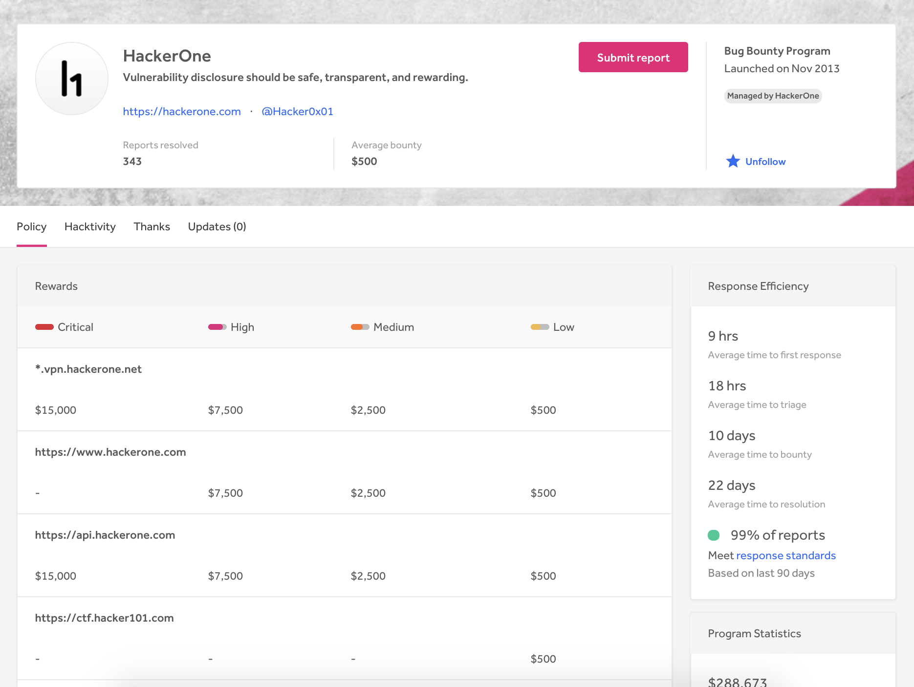
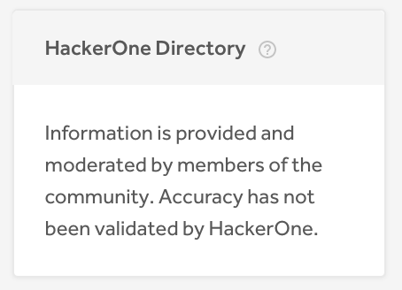
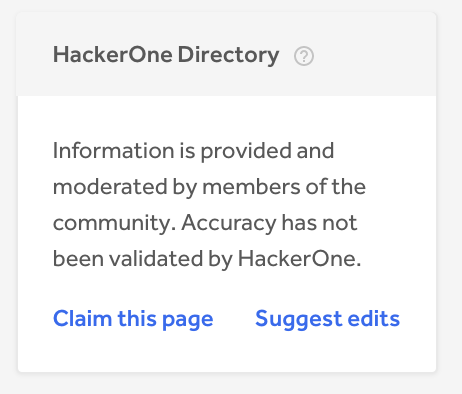

A program's Security Page contains key information about your program and your security disclosure policy. The Security Page sets expectations for hackers you invite to your bounty program and it also outlines your:
* Disclosure policy
* Bug eligibility
* Policy for in-scope eligibility
* Bounty reward structure

### Completing the Security Page

To edit your Security Page, go to **Settings > General > Information**.

A complete security page includes the following:
* Logo
* Cover Photo
* Overview
* Disclosure Policy
* Disclosure Rules
* Report Eligibility
* Reward Structure
* Policy

It's important to keep your security page up-to-date so hackers always know the important details about your program. Check out the security pages for Yahoo!, Twitter, and Dropbox for reference.

### Claiming the Security Page

Unless a security page is claimed, the page is curated by the HackerOne community. An organization can claim their security page in order to:
* Take editorial control of their disclosure policy
* Self-update their information
* Own their policy messaging

You don't have to be a HackerOne customer in order to claim a Security Page, though signing up for a free HackerOne account is necessary.

To claim a security page:
1. Find an unclaimed security page in the directory.

><i><b>Note:</b> Unclaimed pages have the **Claim this page** and the **Suggest edits** link. Claimed pages don't have these links available.</i>

Claimed Directory Page | Unclaimed Directory Page
---------------------- | ------------------------
 | 

2. Click the **Claim this page** link.
3. A HackerOne staff will either approve or reject your claim request. If your request is approved, you'll be given editing rights to the entire page.  

HackerOne reviews each claim submission for validity before granting the claim. A security page can only be claimed once. Once you claim your security page, the community can no longer edit it.

><i>Note: Hackers looking to claim a page need to be above a certain reputation threshold to be given direct editing rights. If they don't have rights, they can suggest changes which will get reviewed and approved by HackerOne staff.</i>

### Suggesting Edits on the Security Page

You can suggest edits to any unclaimed security page by clicking on the **Suggest edits** link. A HackerOne staff will review your changes and approve them if they are valid.
