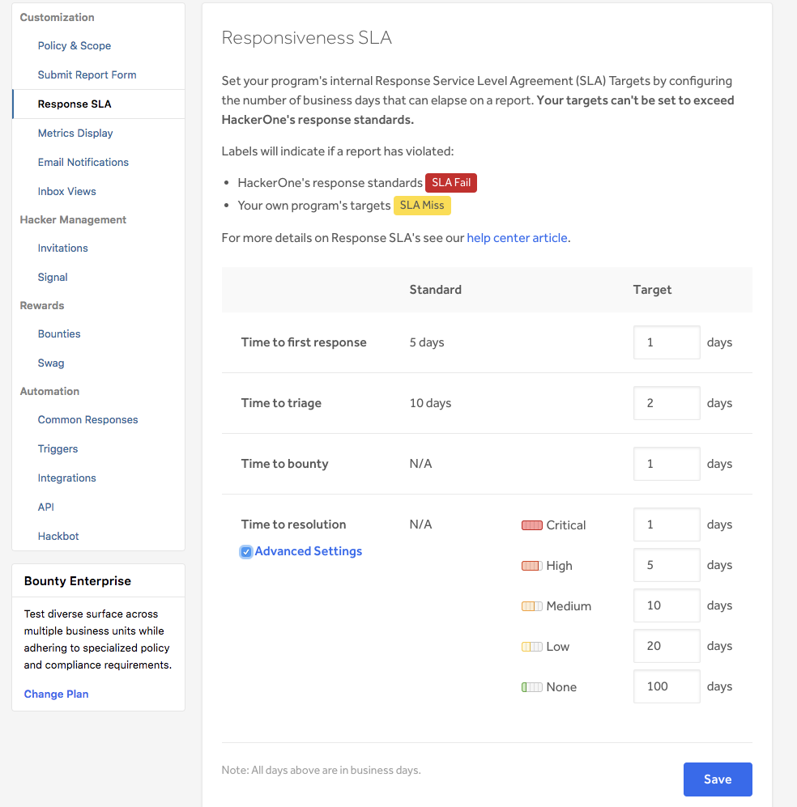

You can customize your program's response SLA times by configuring the number of business days. To customize your program's response SLA time: 
1. Go to **Settings > Program > Response SLA**. 
2. Input the target response SLA time in days for your program under the **Target** column. 

Keep in mind that:
* It's recommended that you're targets fall within the Recommended and Limit times. 
    
Time | Recommended | Limit 
-------- | ----------- | -----
Time to first response | 1 day | 5 days 
Time to triage | 2 days | 10 days 
Time to bounty | 1 day (after triage) | N/A 
Time to resolution | 30 days | N/A 
    
* To edit your program's response SLA settings, you need to have program permissions. 
* Modified targets will be applied to reports created after the modification. 
* Reports created before modification will have previous SLA targets applied. 

