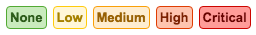
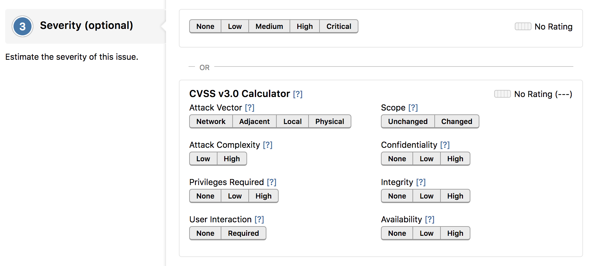

Reports are marked with a severity rating to show how severe the vulnerability is in the report submission form. The severity rating can be seen on reports, hacktivity, and in the inbox. On HackerOne, severity is particularly useful for structuring bounty ranges and is used when offering bounty recommendations. The severity level can be marked as:

HackerOne utilizes the Common Vulnerability Scoring System (CVSS) - an industry standard calculator used to determine the severity of a bug. CVSS enables a common language around the severity of bugs. Hackers can either choose a severity level based on their own judgment of the vulnerability, or they can use the CVSS calculator to give more information about the vulnerability and calculate an exact CVSS score.

The CVSS Calculator provides a way to capture the principal characteristics of a vulnerability and produces a numerical score reflecting its severity. The numerical score is directly mapped to one of these descriptors: None, Low, Medium, High, Critical. These descriptors can then help you assess and prioritize your inbound vulnerabilities.

There are 8 metrics defined for CVSS v3. The first 5 are about the attack method itself, while the latter three are dependent on how your program assesses impact - the direct consequence of a successful exploit. These are the different components to the CVSS Calculator:

Option | Details
------ | -------
Attack Vector | How exploitable the vulnerability is. The score increases the more remote an attacker can be in order to exploit the vulnerability.
Attack Complexity | The conditions beyond the attacker's control that must exist in order to exploit the vulnerability.
Privilege Required | The level of privileges an attacker must possess before successfully exploiting the vulnerability. The severity increases as fewer privileges are required.
User Interaction | Whether the vulnerability can be exploited solely at the will of the attacker or whether a separate user (or user-initiated process) must participate in some matter.  
Scope | Whether a successful attack impacts a component other than the vulnerable component.
Confidentiality | The impact of the bug as it relates to confidential information being accessed.
Integrity | Whether the data can be modified due to the vulnerability.
Availability | Whether data or functionality can be rendered inaccessible. The impact to the availability of the impacted component.  

Instead of using the CVSS calculator, hackers can simply choose an estimated severity for the report.    

If your program has a custom methodology for determining severity, it's best to describe it on your Security Page.

><i>Note: It's optional for the hacker to submit a severity rating.</i>

You can read more details about CVSS [here](https://www.first.org/cvss/user-guide) or check out our [blog post](https://www.hackerone.com/blog/introducing-severity-cvss).  
