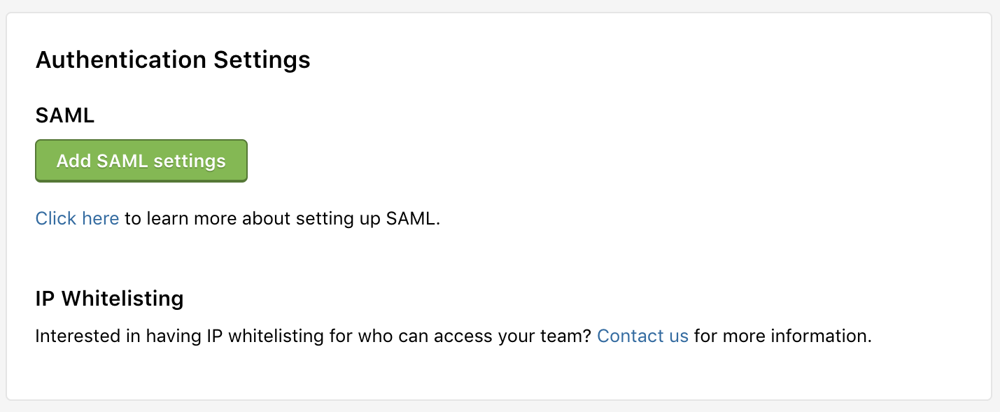
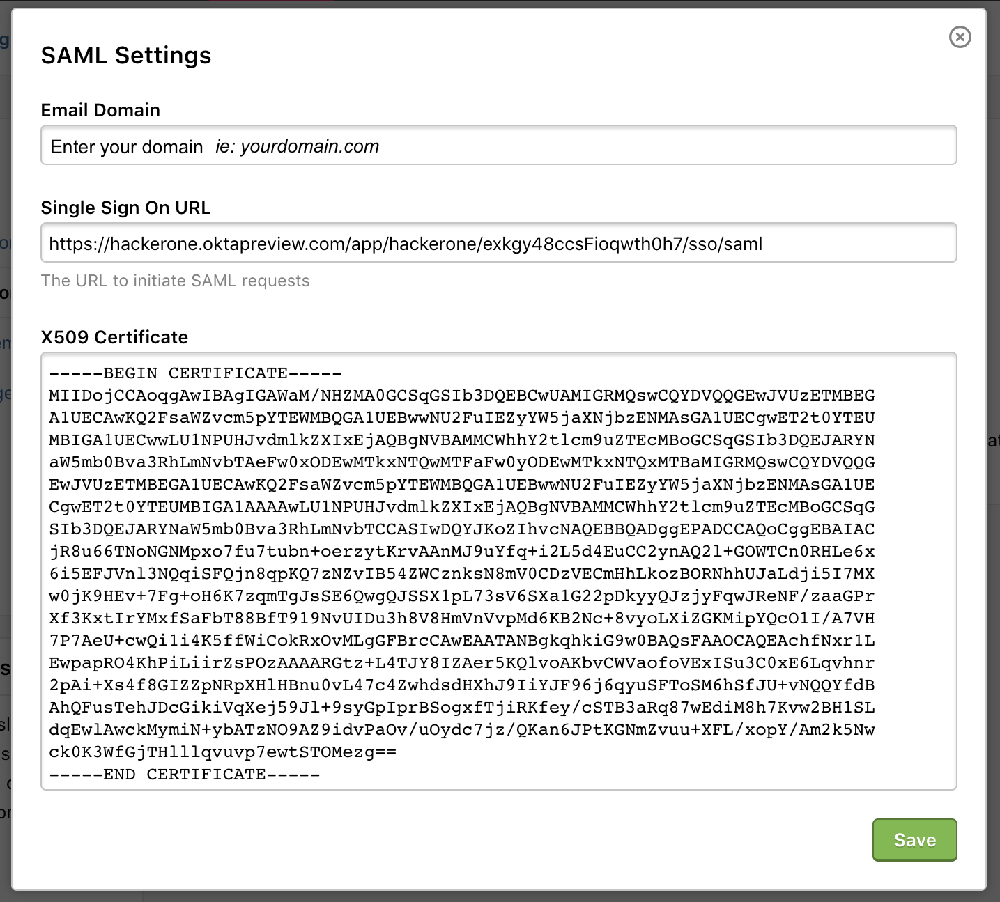
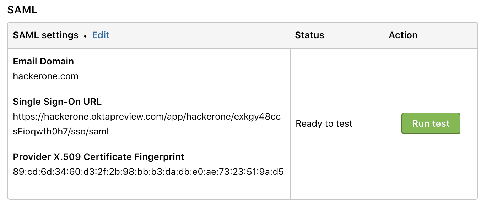
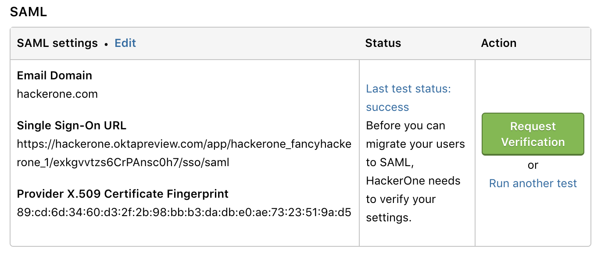
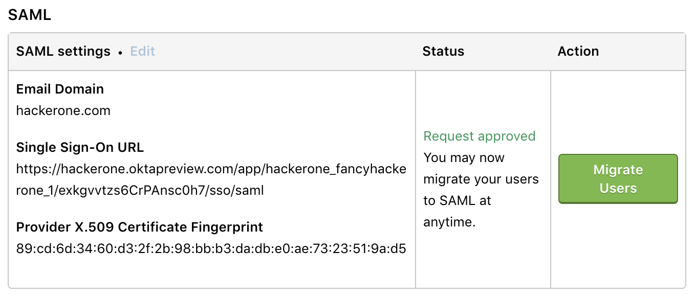
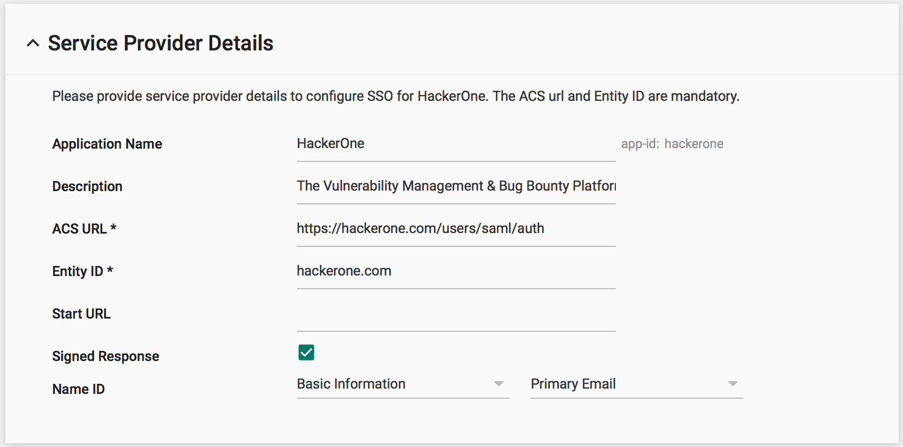

HackerOne supports Single Sign-On (SSO) through Security Assertion Markup Language 2.0 (SAML 2.0) for these providers:
* [Google](/programs/google-sso-saml-setup.html)
* [Okta](/programs/okta-sso-saml-setup.html)
* [OneLogin](/programs/onelogin-sso-saml-setup.html)
* [Bitium](https://support.bitium.com/administration/saml-hackerone/)
* Centrify
* MS ADFS
* [Azure Active Directory](https://azuremarketplace.microsoft.com/en-us/marketplace/apps/aad.hackerone)
* Ping Identity
* [Duo](https://duo.com/docs/hackerone)
* [JumpCloud](https://support.jumpcloud.com/support/s/article/single-sign-on-sso-with-hackerone2)

[Contact HackerOne](https://support.hackerone.com/hc/en-us/requests/new) if you have another SAML provider.

### Set Up
To configure Single Sign-On via SAML:
1. Go to: **Settings > General > Authentication**.
2. In the **SAML** section, click **Add SAML settings** to add your provider information.

3. Enter information for these fields:

Field | Details
------ | ------
Email Domain | The email domain for users that will be required to use SAML authentication. *Note: Please use your own domain, not the HackerOne domain.*
Single Sign On URL | The URL from your SAML provider to initiate a single sign-on attempt, sometimes called the login URL.
X509 Certificate | The certificate from your SAML provider to verify the single sign-on response

4. Click **Run test**. This will launch a new window that'll allow a test login.

5. Enter your login credentials to the test window. After your login attempt, the test will either succeed or fail and provide warning messages about your test login in the **Status** section.
6. Click the **Run another test** link if your test fails. If your test is successful, request approval of your settings by clicking **Request Verification**.

8. HackerOne will review and verify your SAML settings and notify you within 1 business day after the review is complete.
9. After HackerOne approves your request, click the **Migrate Users** button when you're ready to enable SAML for all of your users.

><i>Note: Your program must be launched and not in sandbox mode to set up SAML.</i>

### Additional Information
Here are some screenshots that provide additional details on Service Provider and Attribute mapping:

