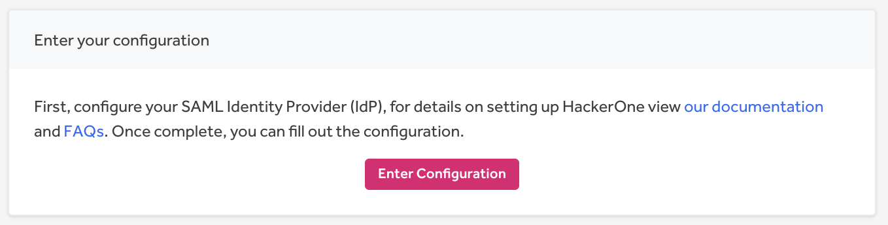
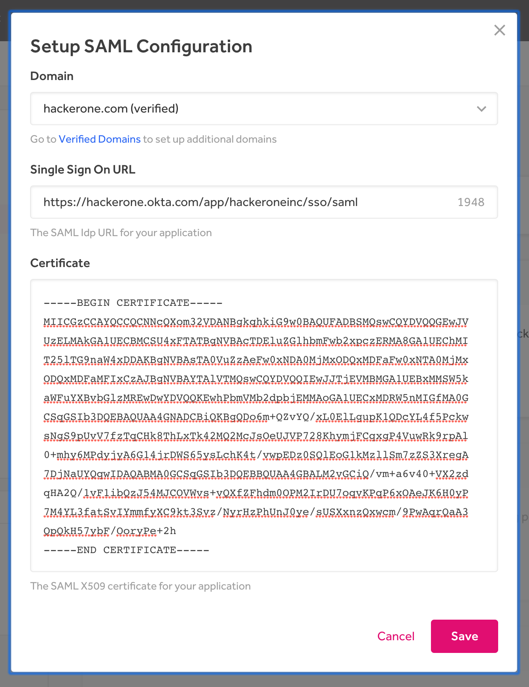
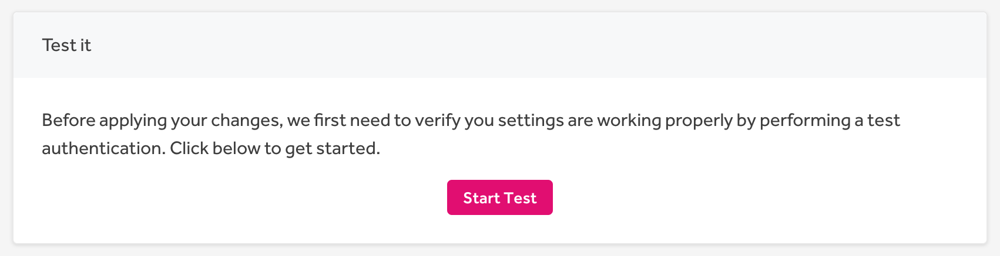
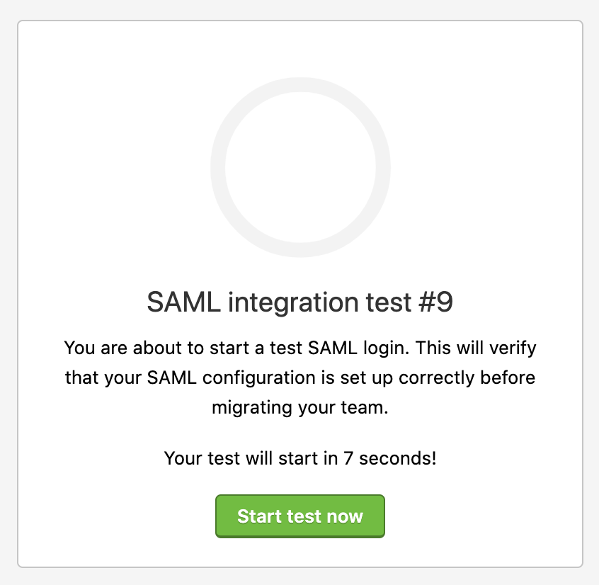
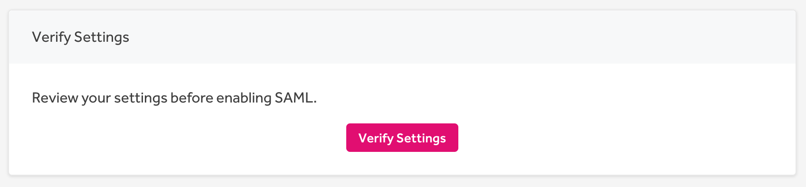

HackerOne supports Single Sign-On (SSO) through Security Assertion Markup Language 2.0 (SAML 2.0) for these providers:
* [Google](/programs/google-sso-saml-setup.html)
* [Okta](/programs/okta-sso-saml-setup.html)
* [OneLogin](/programs/onelogin-sso-saml-setup.html)
* [Bitium](https://support.bitium.com/administration/saml-hackerone/)
* Centrify
* MS ADFS
* [Azure Active Directory](https://azuremarketplace.microsoft.com/en-us/marketplace/apps/aad.hackerone)
* Ping Identity
* [Duo](https://duo.com/docs/hackerone)
* [JumpCloud](https://support.jumpcloud.com/support/s/article/single-sign-on-sso-with-hackerone2)

[Contact HackerOne](https://support.hackerone.com/hc/en-us/requests/new) if you have another SAML provider.

><i>Note: Your program must be launched and not in sandbox mode to set up SAML.</i>

### Set Up
To configure Single Sign-On via SAML:
1. Go to: **Program Settings > General > Authentication**.
2. Click **Setup SAML** in the *Single Sign-on with SAML* section.

3. Click **Enter Configuration** on the *SAML Configuration* page.

4. Enter information for these fields:

Field | Details
------ | ------
Domain | The  domain for users that will be required to use SAML authentication. The domain must be verified before entering. If you don't have a verified domain, see [Domain Verification](domain-verification.html) to set up a verified domain.  *Note: Please use your own domain, not the HackerOne domain.*
Single Sign On URL | The URL from your SAML provider to initiate a single sign-on attempt, sometimes called the login URL.
X509 Certificate | The certificate from your SAML provider to verify the single sign-on response.

5. Click **Save**.
6. Click **Start Test** in the *Test it* section of the SAML Configuration page.

7. Click **Run test** in the *SAML Settings Test* modal that pops up.
8. Click **Start test now**.

9. Enter your login credentials to the test window. After your login attempt, the test will either succeed or fail and provide warning messages about your test login. If your test fails, run another test by going back to step 6 above.
10. Click **Verify Settings**.  

11. Click **Verify** in the *Verify SAML Settings* modal. Once you verify your settings, you won't be able to change your settings or run tests on the domain anymore.

12. Click **Enable SAML** once you're ready to migrate all user accounts to SAML authentication.
13. Click **Enable** in the *Enable SAML* modal that pops up.

Once you've successfully enabled SAML, all users that are part of the domain will be required to authenticate using SAML. The passwords associated with those accounts will be removed. Users will receive instructions on their first log in informing them of the change.

### Additional Information
Here are some screenshots that provide additional details on Service Provider and Attribute mapping:

