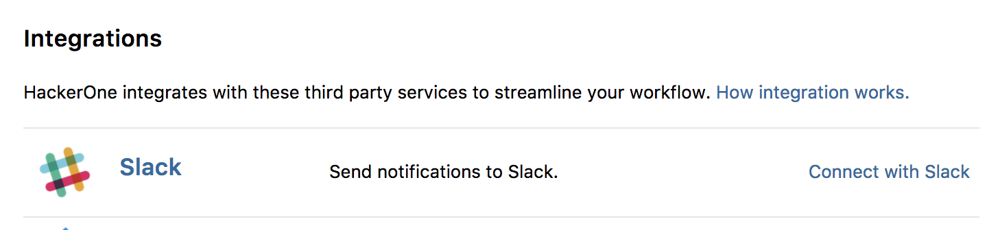
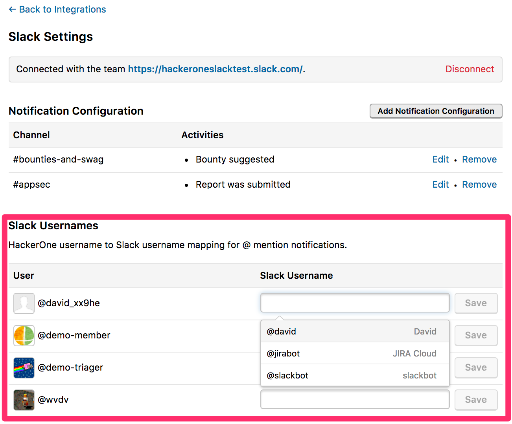

With Slack integration, your team can stay up to date on HackerOne report activities without needing to leave Slack. Activities such as report triaged, bounty paid, and new comments added will trigger notifications in your selected channel. You can customize which activities you want to be notified about in which channels so that teams can only see what’s relevant to them.

<i>Note: Slack integration is only available to H1 Response and H1 Bounty Pro (and above) customers. For more details, see product editions. Existing users of the Slack integration will also need to navigate to **Settings > Program > Integrations > Slack** to enable the new settings.</i>

### Set Up Slack Integration
To set up slack integration:
1. Go to **Settings > Program > Integrations**.
2. Click the **Connect with Slack** link. 
    
3. Click **Authenticate with Slack**. 
4. You'll be redirected to a Slack authorization screen where you'll be asked to grant HackerOne permissions to access your team. *Note: If you have multiple Slack teams, select the one you want HackerOne to post to.*
5. Click **Authorize** and you'll be redirected back to HackerOne to continue the setup of your Slack notifications.   *Note: the following privileges are necessary for HackerOne to successfully set up Slack Integration:*
     * **Access information about your public channels** is needed to allow the admin configuring the integration to see all your current Slack channels which they can assign notifications towards.
     * **View email addresses of people on your team** is needed in order to set up username mapping between H1 and Slack for proper mentions.
     * **Access your team's profile information** is a standard permission for all Slack integrations. At this time we don't have a way to reduce permissions if customers don't want to use all of these features.

### Add Notification Configuration for Slack
You can configure specific HackerOne activities you'd like to receive Slack notifications for.

To set up your notification configuration:
1. Go to your Slack integration settings in **Settings > Program > Integrations**.
2. Click **Create your first Notification Configuration**.
3. Select the public channel to post to in the **Post to Channel** field. 
4. <i>(Optional)</i> Select **I want to use a private channel** to post your notification to a private channel, and manually type in the name of the private channel.  
  

4. Select the specific activities you want to send to the channel. You can choose these options from these categories:

Category | Options
-------- | ---------
Report life cycle | You can select to receive notifications for various report actions such as: Report was submitted and Report was triaged.
Awards | * Bounty suggested  * A bounty has been paid  * Not eligible for bounty  * Swag was awarded
Disclosure | * Agreed on going public  * Report became public  * Manually disclosed
Misc | * The assignee of the report has been changed  * An internal comment was added to the report  * A public comment was added to the report  * Report locked, hackers can't reply on the report anymore

5. Click **Save**. 

All of your selected notifications now be posted to your selected channel on Slack. To configure posting notifications to other channels, click **Add Notification Configuration** and follow steps 3-5 again. 

### Mapping Usernames
After configuring channel notifications, you have the option to map HackerOne usernames to Slack usernames. It's important to establish a link between these two usernames because when someone mentions your username in HackerOne, you’ll be notified just as if someone mentioned your username natively in Slack. This'll ensure that you are appropriately notified in Slack to pay attention to the most critical HackerOne notifications when your username is mentioned specifically for a follow-up comment or action.

To map usernames in your Slack settings: 
1. Go to the **Slack Usernames** section. 
2. Type the Slack username associated with the corresponding HackerOne user in the Slack Username field.
3. Select the user from the dropdown.
4. Click **Save**. 

### Disconnecting Slack Integration
To disconnect your slack integration, go to **Settings > Program > Integrations > Slack** and click **Disconnect** in your Slack settings. 
