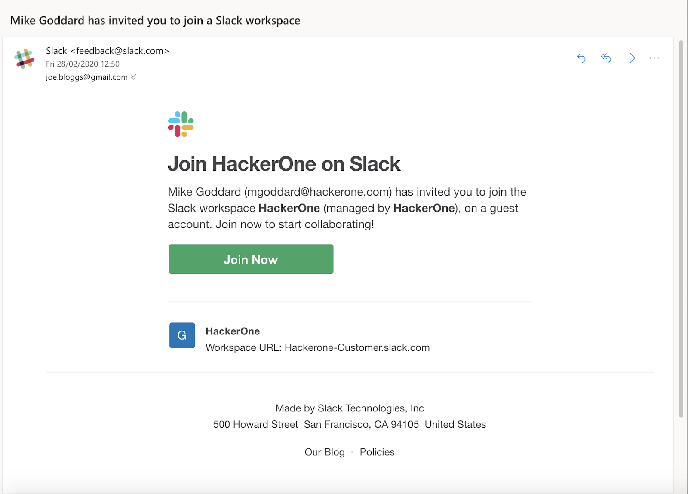
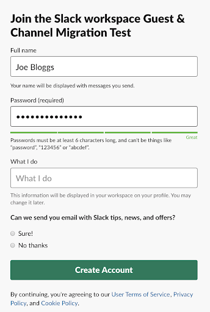

Shared channels enable you to work with HackerOne in a single channel from your own workspace. Accessing shared channels from your own workspace enables you to adhere to the security standards of your own organization instead of having to implement the workspace login security standards of HackerOne. [Learn more about Slack’s shared channels](https://slack.com/intl/en-gb/help/articles/115004151203-A-guide-to-shared-channels).

Your workspace’s respective Slack administrator is responsible for adding members to the channel. For instance, HackerOne manages access to the channel for HackerOne members only, while your organization’s Slack admin will only grant access to members within your organization.

### Create a Shared Channel
Either you or HackerOne can initiate the shared channel set up process. To set up a shared channel:

1. [Create the channel in Slack](https://slack.com/intl/en-gb/help/articles/360035092414-Create-shared-channels-Create-shared-channels#create-a-new-channel-1).
2. Create a sharing link as per [Slack’s instructions](https://slack.com/help/articles/360035092414-Create-shared-channels-Create-shared-channels#share-an-existing-channel-1).
3. Send the link for the channel to any HackerOne member.
4. Wait for the HackerOne administrator to approve the channel.
5. Approve the shared channel once you receive notification that the channel has been approved by HackerOne.

### Joining the HackerOne Slack Workspace as a Guest User
You can join HackerOne’s Customer Slack workspace (https://hackerone-customer.slack.com) as a guest user to have your team collaborate with HackerOne staff.

> **Note:** It’s your responsibility to inform HackerOne in a timely manner when a member’s access is to be revoked.

To join Hackerone’s Slack workspace as a guest:
1. Click the Join Now button in your Slack invitation email.

2. Enter your username and create a password for your account.

3. Click **Create Account**.
4.[Set up two-factor authentication](https://slack.com/intl/en-gb/help/articles/204509068-Set-up-two-factor-authentication) (2FA). (*Note: Be sure not to authenticate using SMS. Always use an authentication app to enable 2FA.*)

### About HackerOne's Slack
HackerOne uses Slack’s [Enterprise Grid](https://slack.com/help/articles/360004150931-What-is-Slack-Enterprise-Grid) with [Encryption Key Management](https://slack.com/enterprise-key-management?cvosrc=helpcenter.helpcenter.helpcenter_ekm_help_center&cvo_creative=&utm_medium=helpcenter&utm_source=helpcenter&utm_campaign=_helpcenter_helpcenter____ob-_cr-_ym-) (EKM) enabled. When inviting customers to HackerOne’s Slack, HackerOne uses a workspace in our grid, hackerone-customer.slack.com. By default, HackerOne doesn’t make these channels private as the workspace is already restricted to a subset of HackerOne employees. In order to provide the best level of service, HackerOne avoids making these channels private so no one is prevented from supporting a customer when another employee is on vacation or leaves the organization. Customers who share channels with HackerOne won’t have access to this workspace at all, and customers who have access as guests will have access only to the channels that are relevant to their organization(s). 

The use of Slack’s EKM enables HackerOne to own the encryption keys for all of HackerOne’s Slack workspaces including `hackerone-customer.slack.com`. (*Note: Slack does not yet support EKM on shared channels.*)

All employees of HackerOne access Slack using Single Sign-On provided by our identity provider, Okta, along with Multi-Factor Authentication backed by Duo. Access to the Hackerone-customer workspace is limited to customer success team members, limited amounts of sales and product members, and administrators of the HackerOne Enterprise Grid organization (IT staff).

Note: HackerOne is migrating customer workspaces and there may be some users on our legacy workspace `hackerone-managed.slack.com` until this migration is complete ideally by end of Q2 2020
