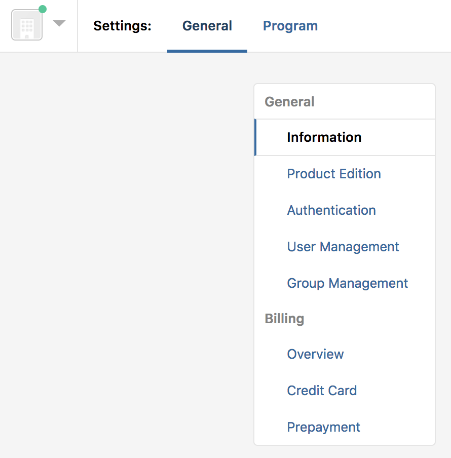
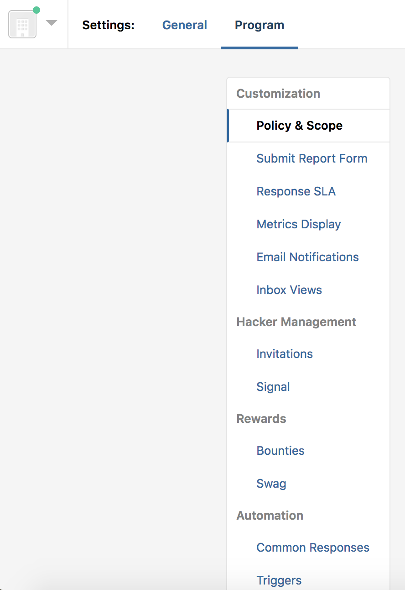

Bounty programs incentivize hackers to test for critical vulnerabilities. You can choose between 2 types of programs:
* A fully-managed program enables HackerOne to design, manage, and support your program from end to end.
* A self-managed program enables you to run and manage your own program.

If you elect to **Start H1 Bounty**, to get your bounty program up and running, follow these steps:

1. Configure your general settings under **Settings > General**. You can set up these settings:

 Option | Detail
 ------ | ------
 Information | Configure what information shows on your program's Security Page. You can choose from these fields:   * Name   * Handle   * Website   * Twitter handle   * About   * Cover color
 Product Edition | Select your product editions. You can choose between Bounty Professional and Bounty Enterprise.
 Authentication | Configure your authentication settings. You can set up SAML and IP Whitelisting.
 User Management | Invite and manage users in your program. You can manage which groups each member is a part of.
 Group Management | Add and Edit various groups in your program. You can also add and remove users to these groups.
 Billing | Enter your billing info in the **Overview, Credit Card**, and **Prepayment** tabs.

 

2. Under **Settings > Program** configure these settings for your program:

 Option | Detail
 ------ | -------
 Policy & Scope | Customize your program's policy and scope that you want to communicate to hackers.
 Submit Report Form | Customize your report form that hackers will use to send vulnerabilities about your program.
 Response SLA | Set your program's Response Service Level Agreements (SLA) by configuring your target business days.
 Metrics Display | Select the metrics you want to display on your program's page to communicate to hackers the statistics about your program.
 Email Notifications | Every report activity triggers email notifications sent to members in your program. Select what content you want to include.
 Inbox Views | Configure what tabs you want showing in your inbox.
 Invitations | Set how you want your hacker invitations managed.
 Signal | Configure your Signal Requirement and Human-Augmented Signal settings.
 Bounties | Configure bounty and reward settings.
 Swag | Select whether your program would like to give swag as a reward.
 Common Responses | Set default common responses to reply in your reports.
 Triggers | Set triggers to execute automated responses to new, incoming reports. With triggers, you can set up an automated action when your program receives a report with a given trigger word.
 Integrations | Configure your integrations with other services to streamline your workflow.
 API | Create API tokens.
 Hackbot | Hackbot is HackerOne's free automated service that provides you with guidance regarding your reports by providing contextual advice and actionable items to improve your user experience. Configure which actions you want Hackbot to suggest.

 

Once your program settings have been configured and you exit the setup environment, your program will be live as a confidential, invitation-only program.

When your program is comfortable with the capacity to handle reports received from hackers reach out to customersuccess@hackerone.com to launch your program publicly.
