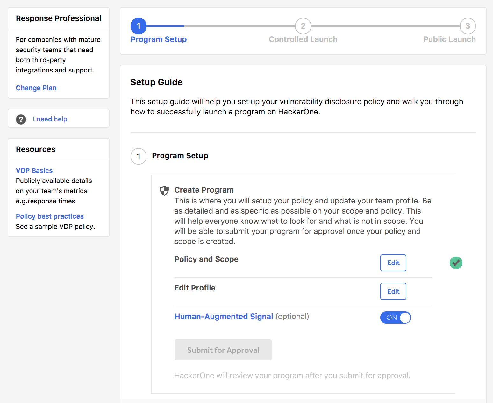

If you elect to **Start H1 Response**, you'll be taken to the Setup Guide where you can walk through the product on how to set up your vulnerability disclosure policy and successfully launch a program. 

1. Select **Edit** to edit your policy and scope. 
2. Select **Edit** to edit your profile. 
3. *(Optional)* Click the [Human Augmented Signal](make this clickable) toggle to be either on or off. 
4. Once you've completed all of the fields in step 1 of the Setup Guide, click **Submit for Approval** to have HackerOne review your program. 
5. If your program is approved by HackerOne, your program will be placed in controlled launch where it'll remain private and visible to only a select number of hackers. To publicly launch your program, your program must:
   * Receive at least 10 reports and have invited 100 hackers
   * Meet the baseline responsiveness limits
6. Once you've met the criteria, contact HackerOne to publicly launch your program. [CHECK WITH DAVID. DO YOU NEED TO CONTACT HACKERONE TO LAUNCH PUBLICLY, OR WILL THE **PUBLIC LAUNCH** BUTTON AUTOMATICALLY BECOME CLICKABLE??????]
