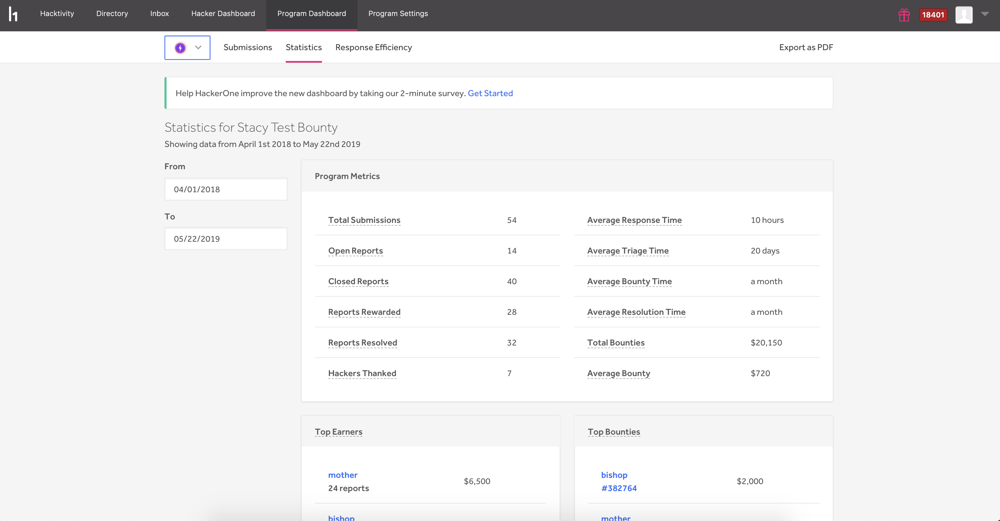

The Statistics page enables you to view overall statistics for your program. You can view these all-time data metrics for your program: 

Item | Details
---- | -------
Total Submissions | The total number of reports submitted to the program.
Valid Submissions | The total number of reports submitted that are currently triaged or resolved.
Open Reports | The total number of reports that are currently in one of the states: pre-submission, new, triaged, needs more info.
Closed Reports | The total number of reports that are currently in one of the states: N/A, informative, spam, duplicate, resolved.
Reports Rewarded | The total number of reports that have been awarded a bounty.
Bugs Resolved | The total number of reports that have been closed as resolved.
Hackers Thanked | The total number of hackers who have 1 or more resolved reports.   
Average Response Time | The average elapsed time between a report being submitted and the first, non-automated response by a team member.
Average Triage Time | The average elapsed time between new and triaged states for any report that has been in the triaged state.
Average Bounty Time | (Only applies to H1B programs) The average elapsed time from when a report is triaged to when a bounty is paid.
Average Resolution Time | The average elapsed time from when a report is submitted to when a report is closed.
Total Bounty | The total bounty amount in dollars paid to the hackers.
Average Bounty | The average bounty amount in dollars of all the reports that were awarded a bounty.

You can also see who the top earning hackers are for your program as well as who the top bounties were paid out to.

