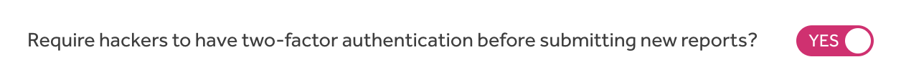
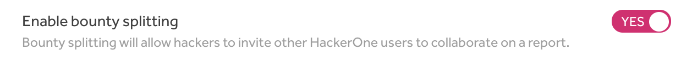

The Submission page enables you to set specific requirements for hackers to submit reports to your program. You can require hackers to meet certain [signal requirements](signal-requirements.html) and set up two-factor authentication.

### Requiring Two-Factor Authentication
To require hackers to have two-factor authentication enabled before submitting reports to your program:
1. Go to <b>Program Settings > Program > Submission</b>.
2. Go to the section on requiring hackers to have 2FA.
3. Click the toggle so that it's set to <b>Yes</b>.

Hackers that have already submitted past reports before 2FA was required will still be able to access and comment on those reports. They, however, won't be able to submit any new reports to your program without enabling 2FA.

### Enabling Bounty Splitting
[Bounty splitting](/hackers/payments.html#bounty-splitting) enables hackers to split the bounty with other hackers that helped collaborate on a report. This enables each hacker to be rewarded for their findings on the report.  

> **Note:** You can only enable bounty splitting if your program uses the [prepayment](billing.html) billing option.

To enable bounty splitting for your program:
1. Go to <b>Program Settings > Program > Submission</b>.
2. Click the toggle so that it's set to <b>Yes</b> for <b>Enable bounty splitting</b>.

