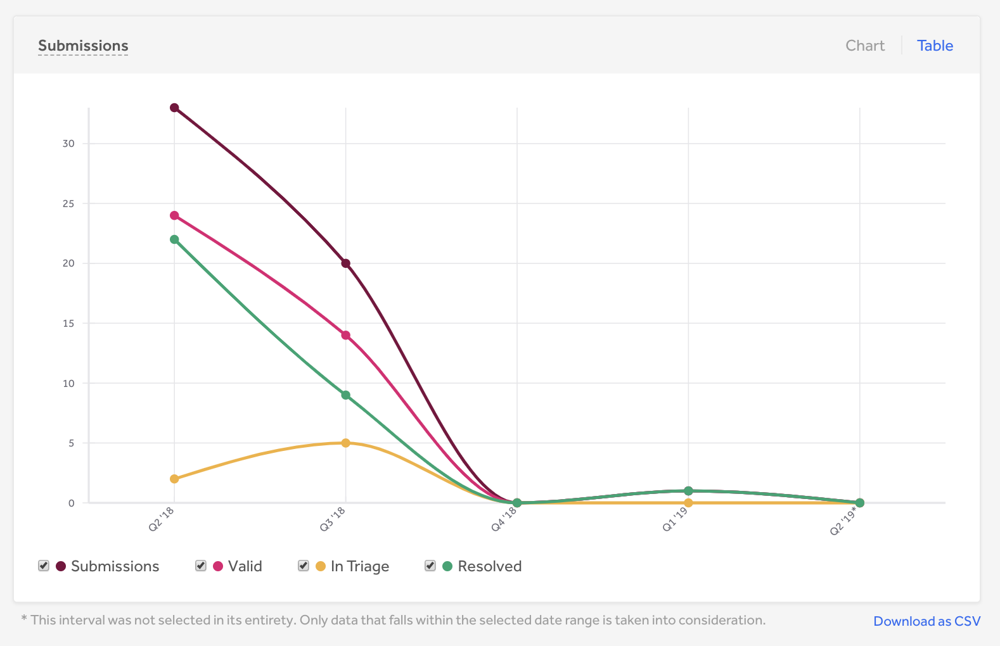
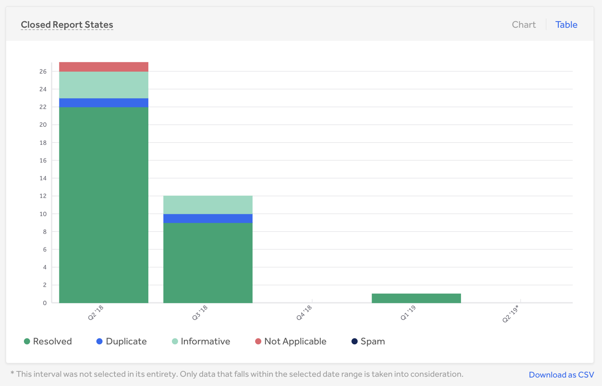
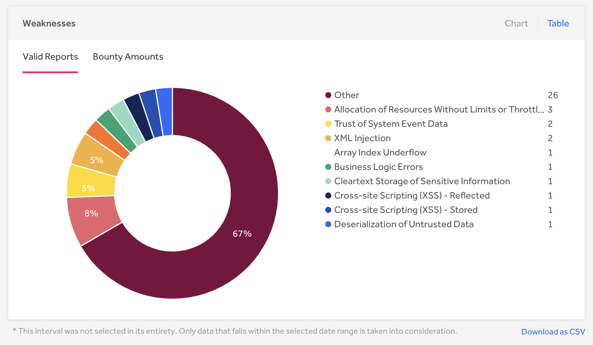
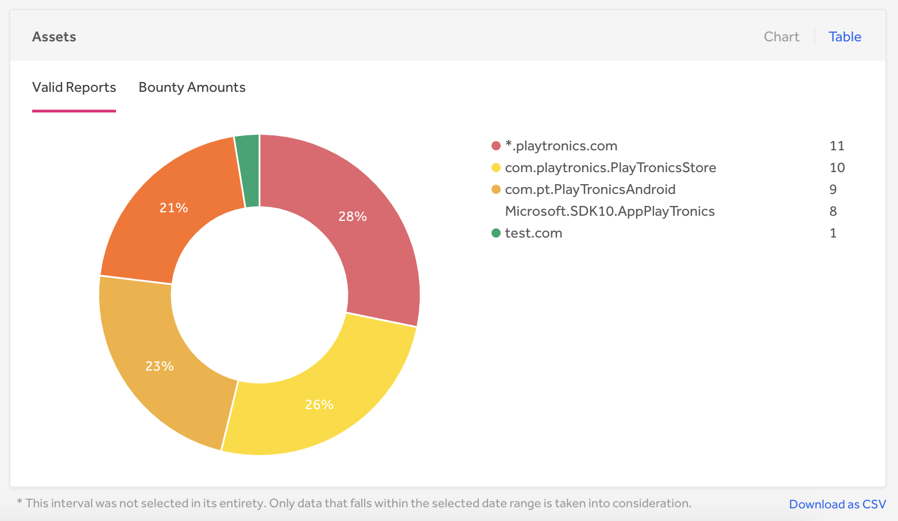

The Submissions page of the Program Dashboard shows data on all report submissions broken up by different metrics.

You can view data for these metrics on the Submissions page: |
------------------------------------------------------------ |
[Submissions](#submissions) |
[Severity](#severity) |
[Closed Report States](#closed) |
[Weaknesses](#weaknesses) |
[Assets](#assets) |
[All-time Metrics](#all-time) |

You can export all of your data at once or by sections to a CSV or PDF file.

<h3 id="submissions">Submissions</h3>
The Submissions section provides a quick overview of your report submission metrics to see any report submission trends. You can view:  

Item | Details
---- | ----------
# Submissions | The total number of reports submitted to the program during the selected time interval.
# Valid | The number of reports submitted during the selected time interval that are currently Triaged or Resolved.
# In Triage | The number of reports submitted during the selected time interval that are currently Triaged.
# Resolved | The number of reports submitted during the selected time interval that are closed as Resolved.
% Valid | The percentage of valid reports submitted during the selected time interval.   

<h3 id="severity">Severity</h3>
The Severity section shows how reports and bounties are distributed by severity. You can view trends on how many valid reports are submitted and paid per severity.  

<h3 id="closed">Closed Report States</h3>
The Closed Report States table shows how your reports are distributed among the various closed states a report can have.  You can view how many reports were:  

Item | Details
---- | -----------
Resolved | The number of reports that are closed as Resolved.
Duplicate | The number of reports that are closed as a Duplicate.
Informative | The number of reports that are closed as Informative.
Not Applicable | The number of reports that are closed as Not Applicable.
Spam | The number of reports that are closed as Spam.

<h3 id="weakness">Weakness</h3>
The Weakness section shows how your reports are spread among the different weakness types. You can view what areas you’re receiving the most valid vulnerabilities in so that you can know which vulnerabilities your program is most susceptible to.

 You can toggle your weakness data by number of valid reports and also by bounty amounts.

<h3 id="assets">Assets</h3>
The Assets section enables you to explore reports and bounties by asset. You can see which asset you’re receiving the most vulnerabilities in and how much bounty is paid out per asset.

 You can toggle your asset data by number of valid reports and also by bounty amounts.

<h3 id="all-time">All-Time Metrics</h3>
You can also view these all-time data metrics for your program:  

Item | Details
---- | -------
Total Submissions | The total number of reports submitted to the program.
Valid Submissions | The total number of reports submitted that are currently triaged or resolved.
Open Reports | The total number of reports that are currently in one of the states: pre-submission, new, triaged, needs more info.
Closed Reports | The total number of reports that are currently in one of the states: N/A, informative, spam, duplicate, resolved.
Reports Rewarded | The total number of reports that have been awarded a bounty.
Bugs Resolved | The total number of reports that have been closed as resolved.
Hackers Thanked | The total number of hackers who have 1 or more resolved reports.   
Average Response Time | The average elapsed time between a report being submitted and the first, non-automated response by a team member.
Average Triage Time | The average elapsed time between new and triaged states for any report that has been in the triaged state.
Average Bounty Time | (Only applies to H1B programs) The average elapsed time from when a report is triaged to when a bounty is paid.
Average Resolution Time | The average elapsed time from when a report is submitted to when a report is closed.
Total Bounty | The total bounty amount in dollars paid to the hackers.
Average Bounty | The average bounty amount in dollars of all the reports that were awarded a bounty.
