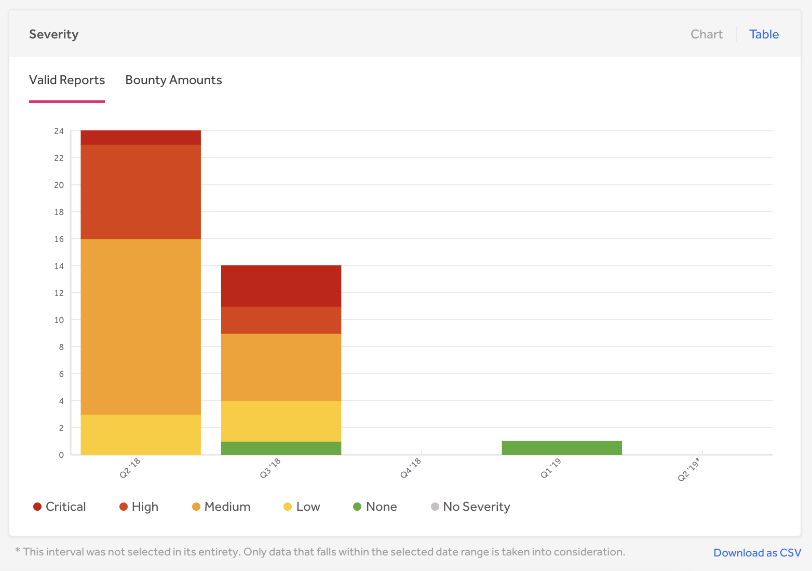

The Submissions page of the Program Dashboard shows data on all report submissions broken up by different metrics.

You can export all of your data at once or by sections to a CSV or PDF file.

### Submissions
The Submissions section provides a quick overview of your report submission metrics to see any report submission trends. You can view:  

Item | Details
---- | ----------
# Submissions | The total number of reports submitted to the program during the selected time interval.
# Valid | The number of reports submitted during the selected time interval that are currently Triaged or Resolved.
# In Triage | The number of reports submitted during the selected time interval that are currently Triaged.
# Resolved | The number of reports submitted during the selected time interval that are closed as Resolved.
% Valid | The percentage of valid reports submitted during the selected time interval.   

### Severity
The Severity section shows how reports and bounties are distributed by severity. You can view trends on how many valid reports are submitted and paid per severity.  

### Closed Report States
The Closed Report States table shows how your reports are distributed among the various closed states a report can have.  You can view how many reports were:  

Item | Details
---- | -----------
Resolved | The number of reports that are closed as Resolved.
Duplicate | The number of reports that are closed as a Duplicate.
Informative | The number of reports that are closed as Informative.
Not Applicable | The number of reports that are closed as Not Applicable.
Spam | The number of reports that are closed as Spam.

### Weakness
The Weakness section shows how your reports are spread among the different weakness types. You can view what areas you’re receiving the most valid vulnerabilities in so that you can know which vulnerabilities your program is most susceptible to.

 You can toggle your weakness data by number of valid reports and also by bounty amounts.

### Assets
The Assets section enables you to explore reports and bounties by asset. You can see which asset you’re receiving the most vulnerabilities in and how much bounty is paid out per asset.

 You can toggle your asset data by number of valid reports and also by bounty amounts.

