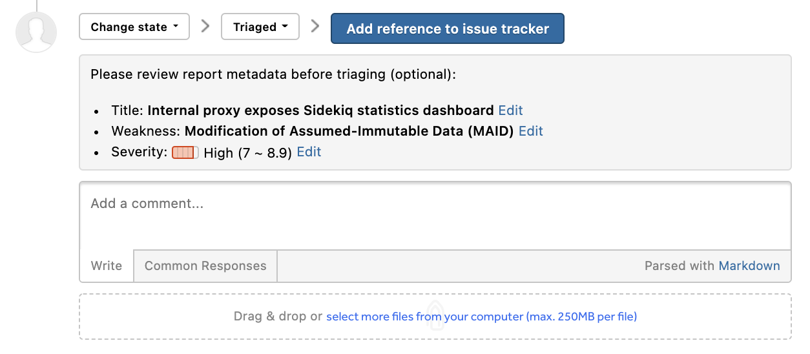
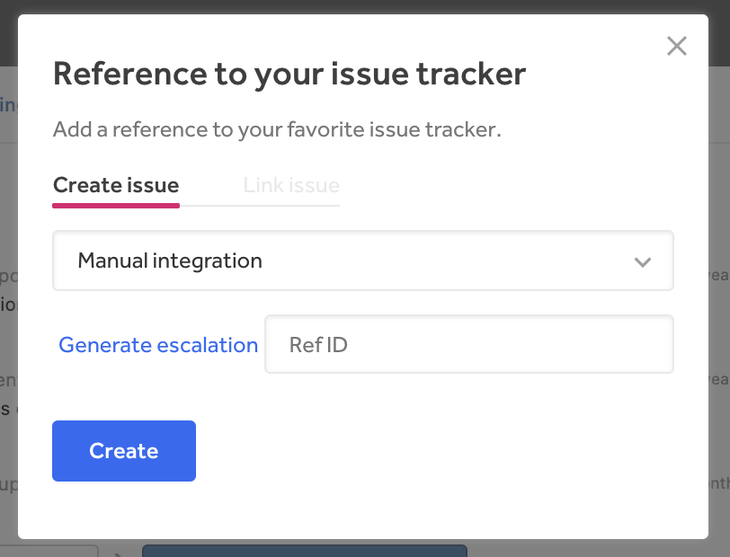

HackerOne integrates with many issue tracking tools. The integration ensures that the HackerOne platform fits into your existing security workflow with minimal friction. Integrating with one of these services will enable you to push report submissions into your preferred systems. You can set up multiple issue tracker integrations as well as a Slack integration.  

HackerOne currently supports these integrations:

  <a class="integration-button" href="assembla-integration.html">
    

      
    

    
Assembla

  </a>
  <a class="integration-button" href="azure-devops-integration.html">
    

      
    

    
Azure DevOps

  </a>
  <a class="integration-button" href="bugzilla-integration.html">
    

      
    

    
Bugzilla

  </a>
  <a class="integration-button" href="freshdesk-integration.html">
    

      
    

    
Freshdesk

  </a>

  <a class="integration-button" href="github-integration.html">
    

      
    

    
GitHub

  </a>
  <a class="integration-button" href="gitlab-integration.html">
    

      
    

    
GitLab

  </a>
  <a class="integration-button" href="hackedu-integration.html">
    

      
    

    
HackEDU

  </a>
  <a class="integration-button" href="ibm-resilient.html">
    

      
    

  
IBM Resilient

  </a>

  <a class="integration-button" href="jira-integration.html">
    

      
    

    
Jira

  </a>
  <a class="integration-button" href="https://jupiterone.com/features/integrations/hackerone-integration/">
    

      
    

    
JupiterOne

  </a>
  <a class="integration-button" href="kenna-security.html">
    

      
    

    
Kenna Security

  </a>
  <a class="integration-button" href="mantisbt-integration.html">
    

      
    

    
MantisBT

  </a>

  <a class="integration-button" href="microsoft-teams.html">
    

      
    

    
Microsoft Teams

  </a>
  <a class="integration-button" href="otrs-integration.html">
    

      
    

    
OTRS

  </a>
  <a class="integration-button" href="pagerduty-integration.html">
    

      
    

    
PagerDuty

  </a>
  <a class="integration-button" href="phabricator-integration.html">
    

      
    

    
Phabricator

  </a>

  <a class="integration-button" href="redmine-integration.html">
    

      
    

    
Redmine

  </a>
  <a class="integration-button" href="servicenow-integration.html">
    

      
    

    
ServiceNow

  </a>
  <a class="integration-button" href="slack-integration.htm">
    

      
    

    
Slack

  </a>
  <a class="integration-button" href="splunk-integration.html">
    

      
    

    
Splunk

  </a>

  <a class="integration-button" href="sumo-logic-integration.html">
    

      
    

    
Sumo Logic

  </a>
  <a class="integration-button" href="trac-integration.html">
    

      
    

    
Trac

  </a>
  <a class="integration-button" href="zendesk-integration.html">
    

      
    

    
Zendesk

  </a>

 

Don't see your issue tracker listed here? [Let us know](https://support.hackerone.com/hc/en-us/requests/new) to get that added for you.

### Using Multiple Integrations
You can set up multiple integrations with HackerOne. To select which issue tracker you want to escalate the HackerOne report to:
1. Change the action picker to **Change state > Triaged** in your report on HackerOne.
2. Click **Add reference to issue tracker**.

3. Select the issue tracker you want to escalate the report to.

4. Click **Generate escalation**. You'll be taken to your integration account where the report will be pre-populated.
5. Submit the issue to create the report in your integrated issue tracker.
6. Copy the report issue number in your issue tracker and paste it in the **Ref ID** field in HackerOne.   
7. Click **Create** to create a direct reference link to the issue in your integrated issue tracker.
