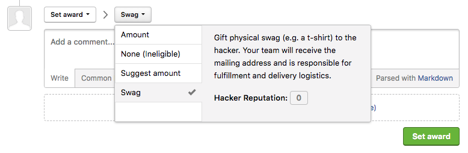
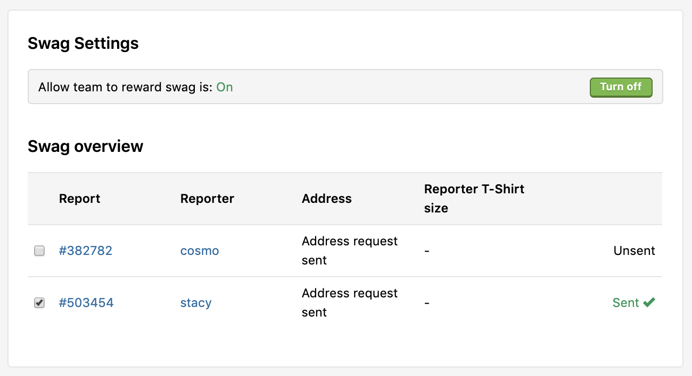

You can award a hacker with various swag in addition to or instead of bounties. Limited edition swag is often well-received as well as free coupons or vouchers for the services or products your organization offers. You can also offer to host hackers near your office or cover their admission to conferences your team may be attending.

To award a hacker with swag:
1. Go to **Settings > Program > Rewards > Swag**.
2. Click **Turn on** to enable your program to reward hackers with swag.
3. Go to your inbox and open the report you'd like to award swag for.
4. Expand the action picker at the bottom of the report above the comment box.
5. Select **Set award**.
6. In the next action picker, change **Award** to **Swag** in the drop-down list.

7. *(Optional)* Add a comment about the award in the comment box.
8. Click **Set award**.
9. Go back to **Settings > Program > Rewards > Swag**.

You'll see an overview of your swag orders that are sent and unsent as well as hacker mailing addresses. Hackers that haven't provided a mailing address or a T-shirt size will be asked to update their profile to provide the necessary information for them to receive swag.

You can select and de-select the checkboxes to manage which requests have been sent and unsent.

Your program is responsible for fulfillment and delivery of swag to the hacker.
