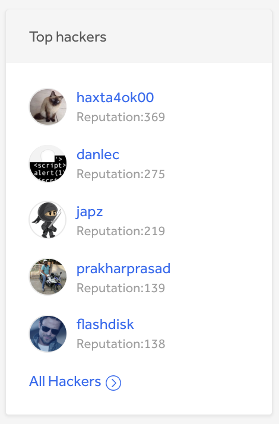
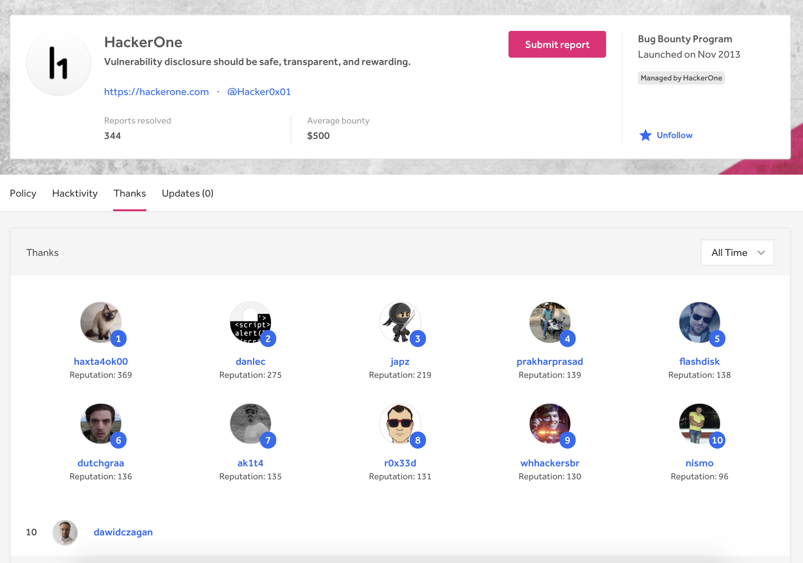
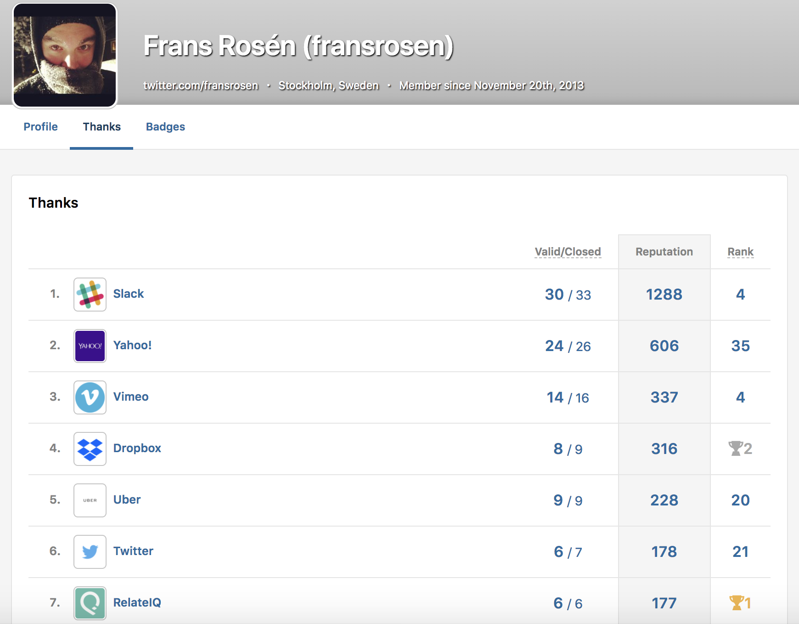

Your Security Page can list the top 5 hackers (ranked by reputation) that disclosed vulnerabilities to your program.

Hackers that earn reputation for a resolved report are automatically recognized and given Thanks on your program. Users viewing the Top Hackers section on your security page can click on <b>All Hackers</b> to be directed to your <b>Thanks</b> page.

### Program Thanks Page
The Thanks page shows all hackers that have submitted a resolved report to your program.  It’s a continued list from the <b>Top hackers</b> list on your Security Page. Giving Thanks to hackers happens automatically for every report where reputation is earned. All hackers will receive Thanks when their report is resolved.

### Hacker Thanks Page
Hackers also have their own Thanks page on their profile where all of the companies they’ve submitted valid reports to are listed. The programs are listed by the hacker’s reputation for each program. The Thanks page is automatically updated after a report is resolved and reputation is gained.

