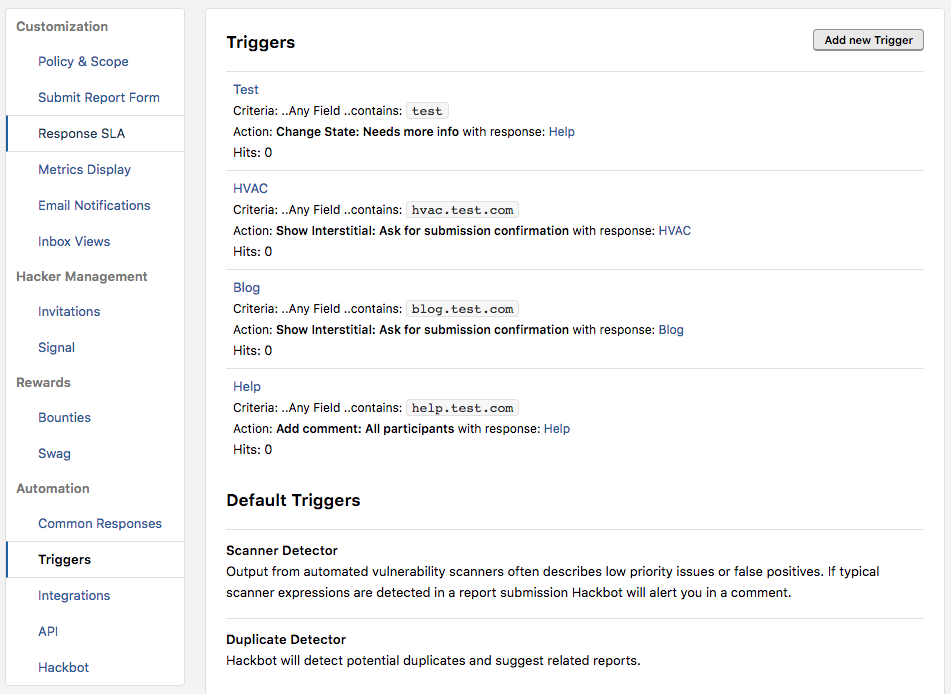
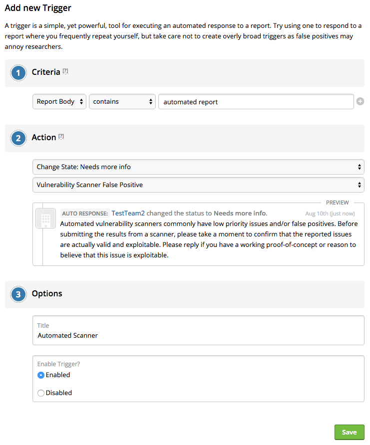
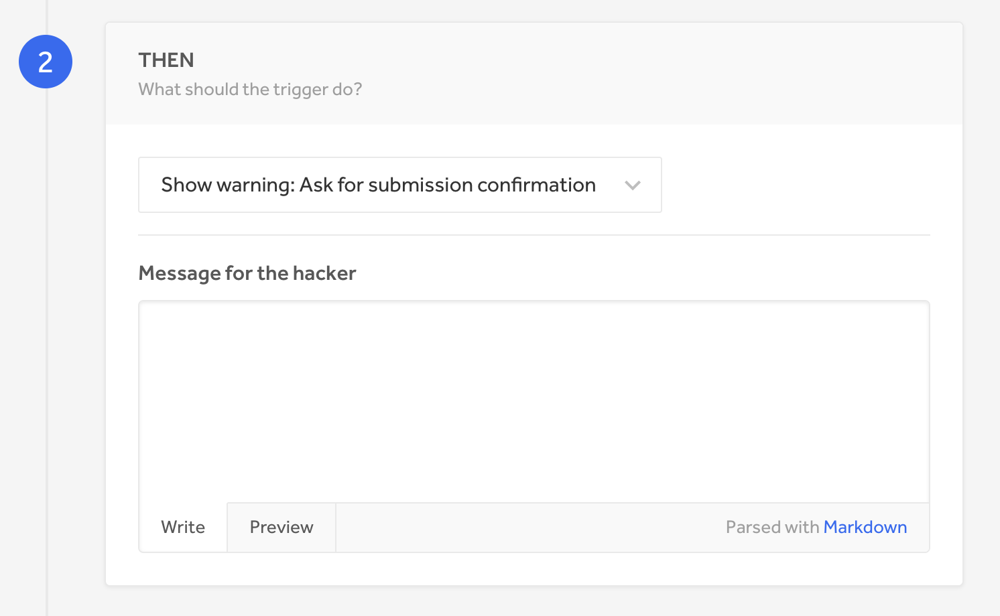

### What are they?
Triggers are simple, but powerful tools for executing automated responses to new, incoming reports. With triggers, you can set up an automated action when your program receives a report with or without a given trigger word. Triggers aid in reducing noise as they can flag certain reports.

### Default Triggers
When you go to Settings > Program > Automation > Triggers, you'll notice a list of default triggers that have already been made for your program. You can choose to edit or delete these triggers.

### Adding Triggers
To add new triggers:
1. Go to **Settings > Program > Automation > Triggers**.
2. Click **Add new Trigger**.

3. In the first dropdown of the **IF** section, you can choose to have your trigger be within:
   * Any Field
   * Report Title
   * Report Body
   * Report Weakness
4. In the second dropdown, select whether you want your trigger to be set off when a specific section of the report either **Contains** or **Does not contain** the trigger.
5. Enter the trigger word(s) in the **Enter trigger criteria** field. Triggers can range from being a single word or phrase and can also include numbers and symbols.

><i>Note: The number and list of existing program reports that meet the criteria of your trigger shows.</i>

6. *(Optional)* Select **add another rule for this trigger** to add more conditions for your trigger.
7. In the **THEN** section, set the action you'd like your trigger to take. You can choose from: 

Option | Details
------ | ------
Show warning: Ask for submission confirmation | Hackers will be asked for submission confirmation
Add Comment: all participants | A public comment will be posted on the report
Change State: Request more information | The report state will be changed to needs more info

8. Type the message you want to give to the hacker when the trigger goes off.
9. Click **Save trigger**.

### Result
Once your trigger is set up, when new, incoming reports meet the criteria of your trigger, the appropriate action will automatically be applied to the report. This will save you time from having to manually respond to every report that comes in. 
