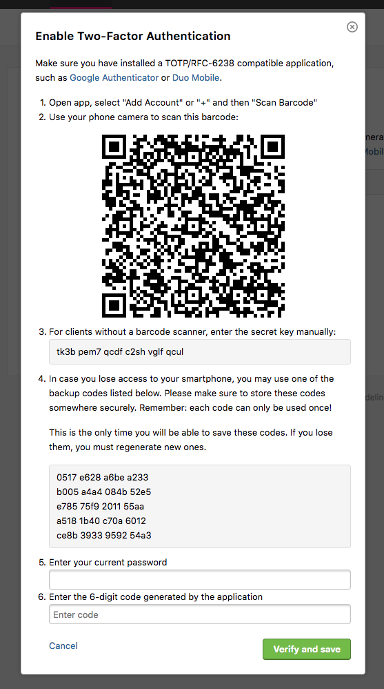

As a team member of a program, you can set up two-factor authentication using any device capable of generating Time-based One-Time Password (TOTP) authentication codes (RFC-6238) to log in to HackerOne. You can use Google Authenticator or Duo Mobile or any other compatible application to generate the codes.

To configure two-factor authentication:

1. Log in to your HackerOne profile.
2. Go to **Settings > Authentication**.
3. Click **Turn on**. *Note: You can only enable two-factor authentication if you're in a launched program.*
4. Follow the steps in the **Enable Two-Factor Authentication** window.  

5. Click **Verify and save**.

Once your two-factor authentication has been verified, when you log in to HackerOne, you’ll be prompted to enter a 6-digit verification code from your authentication application. You must enter the verification code in order to successfully log in to HackerOne.

*Note: Two-factor Authentication is on a per-user basis. You can’t have single-source sign-on (SSO) and 2FA simultaneously.*
