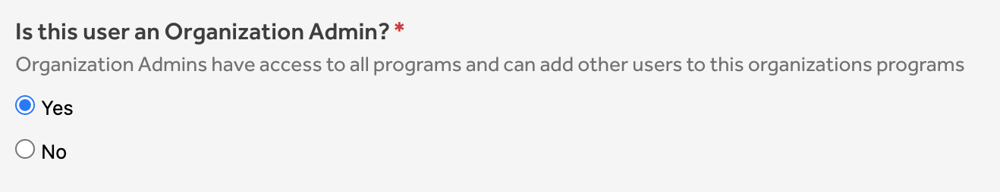

To manage your team members you can go to <b>Organization Settings > User Management</b>. From here you can manage all users across your organization.

### Adding a user to the organization

###  Marking a user as Organization Admin
Organization Admins have access to all programs and can add other users to programs of the organization. To mark someone as Organization Admin:
1. Go the <b>Organization Settings > User Management</b>
2. Find the user that you want to make an Organization Admins
3. Click the pencil on the right to go into edit mode
4. Find the Organization Admin section and select "Yes"

5. Click on "Update User" to save your changes

### Updating access for existing users

### Removing a user from the organization
